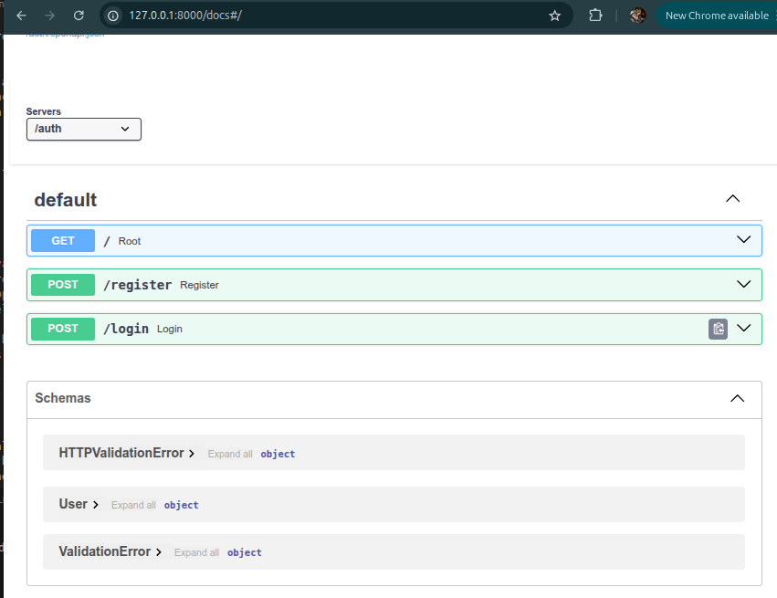

# cs3305_2026_team_8
Repo for CS3305 team project.

## Two ways to expore the auth example
Two ways to experiment around with the auth sample. Firstly simulate your hacking/coding experience you want to spin up/down quickly. Secondly you want to package and run in a container. Each explained as follows.

The following run from `backend/auth` directory

### Hacking

- Navigate to the auth folder and treat it as any simple python app.
- Set up venv - 

```bash
  cd backend/auth/
    # python env setup
  python3 -m venv venv
  source venv/bin/activate
  pip install -r requirements.txt
  # Now load the flask app
  uvicorn main:app --reload
```
- App doesn't do much, but the beauty is you can interact with swagger (fastAPI auto generates) - go experiment.



- This way you can purely focus on your service and develop until you go to the next step.... containerize it....


Open browser - [http://localhost:8000/auth/docs](http://localhost:8000/auth/docs)

### Docker Container

Goal now is to build a container and run it listening on a port. `Dockerfile` should be intuitive.

```bash
docker build -t auth_service .
# Note I use 8001 here to represent what you punch into the browser as a port
# and 8001:8000 means this is mapped to the port 8000 that the docker container is listening on in its network.
docker run -d -p 8001:8000 auth_service
```

Open browser - [http://localhost:8001/auth/docs](http://localhost:8001/auth/docs)

**ADJUST YOUR LOCALHOST:PORTNUMBER TO THE WHATEVER YOU USED IN THE RUN - I.E. 8001 ABOVE.**

### Nuclear Option: Clean All Docker State

If you have run containers manually and want to ensure a completely clean slate before running the full stack, you can remove all containers, images, and volumes with:

```bash
docker compose down --volumes --remove-orphans
docker system prune -af
```

This will stop and remove all containers, networks, images, and volumes not used by at least one container. Use with caution!


### Full Stack with Docker Compose

This step adds the API gateway - take a look at `api_gateway/conf.d/default.conf`. Any new service will copy this block and simply replace `auth` with their service name.

To stand up the stack - look at `docker-compose.yml`. There are 2 steps:

```bash
# Go to the root of the project folder now.
# Build all microservices
docker compose build --no-cache
# Stand up the stack
docker compose up -d
```

The subtle change here is the application is being serviced on port 80.
Note there is no 'web page' - but navigate to `http://localhost/auth/docs` to see Swagger again.
Note the lack of port number - serviced on 80


## Note
Be sure to run a virtual environment to install dependencies. The virtual environment is ignored by Git for integrity reasons so you will need to install dependencies when you first clone this repository.

(On windows, feel free to check Derek's old notes for the exact commands on Linux and Mac, although I don't think it's too different)
1. Go to terminal and type "py -m venv venv"
2. Once the venv folder has been generated, type "./venv/Scripts/activate.bat"
3. In the terminal, install the packages with "pip install -r requirements.txt"
4. Make sure to add "venv/" to the .gitignore file if it is not present
5. In the terminal, type "./venv/Scripts/deactivate.bat
