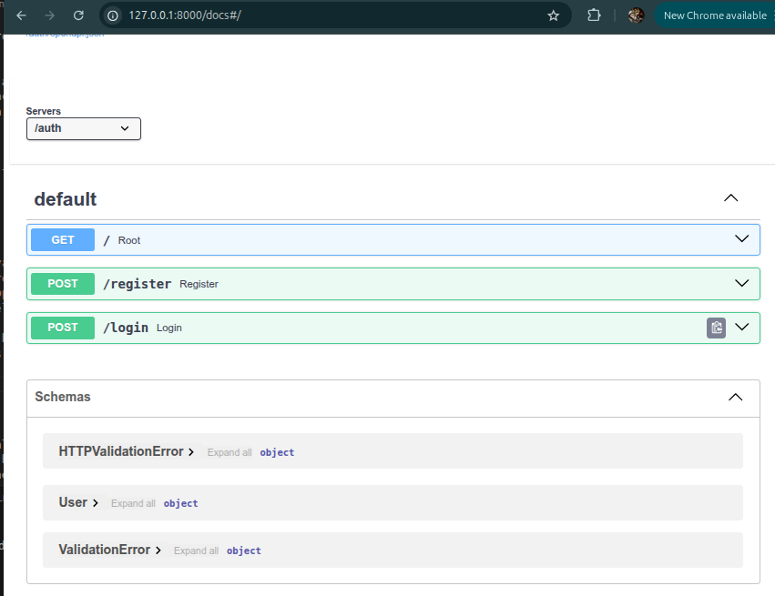

# GoClub - CS3305 Team Software Project
### UCC CS3305 2026 | Team 8

A location-aware social platform that connects users based on proximity, shared groups, and real-time presence. Built with a microservices architecture using FastAPI, SQLAlchemy/SQLite, Valkey, and Docker Compose.

---

## AOSA Report

Official Project Report located — in `report/report.md`

## Website

For an in-depth look at the internals of each microservice, the MkDocs generated site is at — [Docs](https://the-parliment.github.io/cs3305_2026_team_8/)

---

## Team

| Name | Student ID | GitHub |
|------|-----------|--------|
| Cillian | xxxxxxx | @Cillibean |
| Roisin | xxxxxxx | @roisinquinn-05 |
| Joana | xxxxxxx | @Joana-0403 |
| Darren Counihan | 123411792 | @ziller |

---

## What is GoClub?

GoClub allows users to:
- Share their location and see nearby circle members in real-time
- Create and manage public or private groups
- Build an **Inner Circle** — a trusted list of close contacts whose location you can see
- Create and RSVP to events, public or invite-only
- Discover groups your friends are already in

---

## Architecture

The platform is composed of independently deployable services behind an Nginx API Gateway:

| Service | Technology | Responsibility |
|---------|-----------|----------------|
| `api_gateway` | Nginx | Request routing — strips path prefix, proxies to backend |
| `auth` | FastAPI + SQLite | User registration, login, JWT issuance |
| `circles` | FastAPI + SQLite | Invitation-based inner circles |
| `groups` | FastAPI + SQLite | Public and private group management |
| `events` | FastAPI + SQLite | Event creation, invitations, attendance |
| `user` | FastAPI + SQLite | Follow and friend relationships |
| `proximity` | FastAPI + Valkey | Real-time location tracking and nearby friend lookup |
| `frontend` | FastAPI + Jinja2 | Server-side rendered UI |

Shared database models, JWT utilities, and the inter-service HTTP client live in `common/` and are mounted into each backend container at runtime.

```
cs3305_2026_team_8/
├── api_gateway/        # Nginx config and TLS certs
├── backend/
│   ├── auth/           # Authentication service
│   ├── circles/        # Inner circle service
│   ├── events/         # Events service
│   ├── groups/         # Group management service
│   ├── proximity/      # Location & proximity service
│   └── user/           # Follow/friend service
├── common/             # Shared JWT, DB session, ORM models, HTTP client
├── docs/               # MkDocs documentation source
├── frontend/           # Jinja2 server-side rendered frontend
└── docker-compose.yml  # Full stack orchestration
```

---

## Running the Project

**Prerequisites:** Docker and Docker Compose installed.

```bash
# Clone the repo
git clone https://github.com/The-Parliment/cs3305_2026_team_8.git
cd cs3305_2026_team_8

# Build and start all services
docker compose build --no-cache
docker compose up -d
```

The application runs on port 443. Swagger UIs (auto-generated by FastAPI) are available at:

| Service | URL |
|---------|-----|
| Auth | https://localhost/auth/docs |
| Circles | https://localhost/circles/docs |
| Groups | https://localhost/groups/docs |
| Events | https://localhost/events/docs |
| User | https://localhost/user/docs |
| Proximity | https://localhost/proximity/docs |
| Frontend | https://localhost |



---

## Development Setup (Individual Services)

To work on a single service without running the full stack:

```bash
cd backend/auth    # or circles, groups, events, user, proximity
python3 -m venv venv
source venv/bin/activate    # Windows: venv\Scripts\activate.bat
pip install -r requirements.txt
uvicorn main:app --reload
```

Visit `http://localhost:8000/docs` for the Swagger UI.

---

### Docker Container

Goal now is to build a container and run it listening on a port. `Dockerfile` should be intuitive.

```bash
docker build -t auth_service .
# Note I use 8001 here to represent what you punch into the browser as a port
# and 8001:8000 means this is mapped to the port 8000 that the docker container is listening on in its network.
docker run -d -p 8001:8000 auth_service
```

Open browser - [http://localhost:8001/auth/docs](http://localhost:8001/auth/docs)

**ADJUST YOUR LOCALHOST:PORTNUMBER TO THE WHATEVER YOU USED IN THE RUN - I.E. 8001 ABOVE.**

### Nuclear Option: Clean All Docker State

If you have run containers manually and want to ensure a completely clean slate before running the full stack, you can remove all containers, images, and volumes with:

```bash
docker compose down --volumes --remove-orphans
docker system prune -af
```

This will stop and remove all containers, networks, images, and volumes not used by at least one container. Use with caution!

---

## Clean Docker Compose State

If you need a completely clean slate:

```bash
docker compose down --volumes --remove-orphans
docker system prune -af
```

> **Warning:** This removes all containers, images, and volumes. Use with caution.

---

## Development Process

This project follows an Agile methodology managed through GitHub Projects.

### Workflow
- Work is organised into **Epics** broken down into **User Stories** and **Tasks**
- Each feature is developed on a **dedicated branch** linked to its GitHub issue
- Code changes require a **Pull Request** with peer review before merging to main
- Progress is tracked on a **Kanban board** with Todo → In Progress → Done stages

### Branch Naming Convention
```
story/create-group
task/decode-jwt-token
```

### Project Board
Full backlog, sprint progress, and issue tracking:  
[GitHub Projects Board](https://github.com/orgs/The-Parliment/projects/3)

---

## Documentation

Full project documentation is available in the `/docs` folder. A MkDocs generated version is hosted at — [GoClub Website](https://the-parliment.github.io/cs3305_2026_team_8/)

---

## License

[GPL-2.0 License](LICENSE)