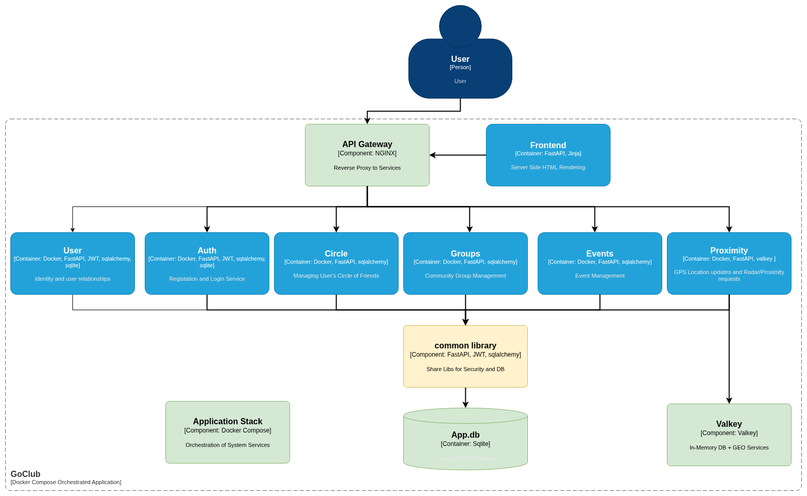

# Architecture Diagram

This diagram represents the high-level architecture of the system. 

Each box is a service or component, and arrows indicate REST data flow.

## Components
- **Frontend**: Server Side HTML Rendering with Jinja.
- **API GATEWAY**: The entry point for all client requests, routes to backend services.
- **AUTH SERVICE**: Handles authentication and user login.
- **PROXIMITY SERVICE**: Manages proximity-based features.
- **EVENT MANAGEMENT SERVICE**: Manages events and interacts with notification bus.
- **GROUP MANAGEMENT SERVICE**: Handles group-related features and interacts with event management.
- **CIRCLE MANAGEMENT SERVICE**: Handles circle-related features and interacts with event management.

Arrows represent the main flows and dependencies between the gateway and each service.

## Architectural Patterns

- **Strong Separation of Frontend and Backend:**
  - The backend services are completely decoupled from the frontend. Backend services do not generate or serve any HTML, CSS, or JavaScript; they only expose APIs for data and business logic.
  - The frontend (Server Side Renderer) is responsible for all user interface and presentation logic, consuming backend APIs via the API Gateway.

- **Stateless, Loosely Coupled Services:**

  - Each backend service is independent and stateless, communicating only through well-defined API contracts.
  - Services do not share state or implementation details, enabling independent development, deployment, and scaling.
  - Each microservice is responsible for its own database schema. There are no foreign key constraints or direct database links between services; all relationships are managed at the application/API level. This ensures loose coupling, independent scaling, and clear service boundaries.

- **Authentication and User Identity:**
  - Upon registration, the Auth Service generates a unique integer user ID for each user.
  - The frontend stores and reuses this user ID for all subsequent interactions with backend services, ensuring consistent user identification across the system.

These patterns enable flexibility, scalability, and maintainability, and are well-suited for modern microservices-based architectures.
