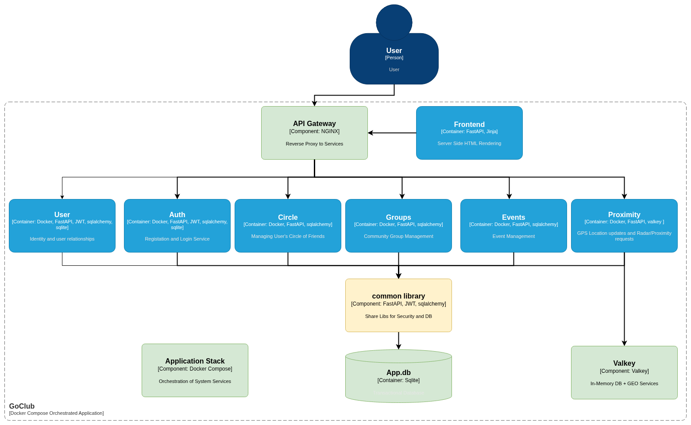

# Architecture

## System Overview

GoClub is a microservices platform. All traffic enters through an Nginx API gateway. The frontend is a server-side rendered Jinja2 application that calls the backend APIs. Backend services communicate with each other directly over the internal Docker network using the shared HTTP client in `common/clients/client.py`.

## Services

| Service | Internal Port | Responsibility |
|---------|--------------|----------------|
| api_gateway | 443 (public) | Nginx — single entry point, strips path prefix, proxies to backend |
| frontend | — | FastAPI + Jinja2 SSR — calls backend APIs, renders HTML |
| auth | 8001 | Registration, login, JWT issuance, user profile CRUD |
| circles | 8002 | Invitation-based friend circles |
| groups | 8003 | Public and private interest groups |
| events | 8005 | Event creation, invitations, attendance, geo search |
| proximity | 8004 | Real-time location tracking and nearby friend lookup |
| user | 8006 | Follow/friend relationships |

## Key Architectural Decisions

### API Gateway — Path Stripping

Nginx strips the service prefix before proxying. A browser request to `/auth/login` becomes `/login` by the time it reaches the auth service. Each service is unaware it sits behind a gateway and registers its routes without any prefix.

### Shared `common/` Library

JWT validation, database session management, ORM models, and the inter-service HTTP client are extracted into a shared `common/` package mounted as a volume into every backend container. All services share the same `decode_and_verify()`, `get_db()`, and ORM models. Any change to `common/` affects all services simultaneously.

### JWT Authentication

The auth service mints signed JWTs on login with the `username` as the `sub` claim. The access token is stored as a cookie (`access_token`) on the client. Every service decodes this cookie locally using `decode_and_verify()` — no service needs to call auth to validate a token. Tokens carry a `typ` claim (`access` or `refresh`) that is validated on decode, preventing refresh tokens from being used as access tokens.

### Shared `requests` Table

All social relationship state — circle invites, group memberships, event attendance, follow requests — is stored in a single `requests` table with a composite primary key `(field1, field2, field3, type)`. The `type` column scopes each row to its owning service. See [requests_table.md](request_table.md) for the full breakdown.

### Inter-Service Calls

Services call each other directly over the Docker internal network using `common/clients/client.py`. The `access_token` cookie is forwarded so the downstream service can authenticate the caller. Key inter-service dependencies:

| Caller | Calls | For |
|--------|-------|-----|
| events | circles `/mycircle` | Bulk invite circle to event |
| events | groups `/listmembers` | Bulk invite group to event |
| events | user `/friends` | Bulk invite all friends to event |
| groups | circles `/mycircle` | Bulk invite circle to group |
| groups | user `/friends` | Friend-based group discovery |
| proximity | circles `/mycircle` | Filter nearby users to circle members only |

### Frontend — Server-Side Rendering

The frontend is a FastAPI application. `frontend/main.py` contains route handlers that call the backend APIs and pass data into Jinja2 templates. JavaScript is used only for map interactions (proximity map, event location picker). The frontend itself sits behind the API gateway and is proxied like any other service.

### Proximity — Valkey vs PostgreSQL

The proximity service is the only one not backed by PostgreSQL. Location data is written frequently, expires naturally when users go offline, and requires efficient radius queries — all properties that make Valkey's in-memory geospatial store a better fit than a relational database. `GEOADD` and `GEORADIUS` handle all distance calculations natively.