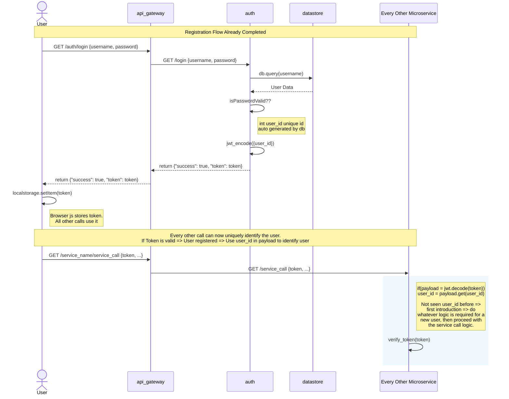

# User Managment Design

At it's most basic, Registation simply services a `POST` HTTP message, extracts the json payload `{user info, password etc}` and persists to a database owned exclusively by the authentication microservice.

The DB should, as its primary key, autogenerate an integer which would be a unique id for the user.

However the question is - for a new user how do all the other microservices become aware of this new user? There are 2 options.

1. Use an event service like **Valkey** (pretty cool and simple). The registation code fires an event. All other services who are interested in 'new users` subscribe. Then when an event is triggered they update their logic for a new user.
2. Leverage jwt tokens and lazy-discover. JWT should be used anyway for security reasons. But we put the `user_id` into the token payload and encrypt it. Then all subsequent calls to other services - which receive the token and have to verify it anyway, can pluck the `user_id` from the jwt token. If its the first time they see that `user_id` value, this implies its the first time this user has called them. We trust the jwt, so that implies we trust the payload, so we know for sure the user exists. Just go update the logic for adding a new user - this is called lazy discover.

Recommend going with 2 for the following reason.

- Radically less code. A few lined extra to extract the id.
- Need more than id? No problem, pack that into the token on creation during login.
- One less microservice running in the system.

