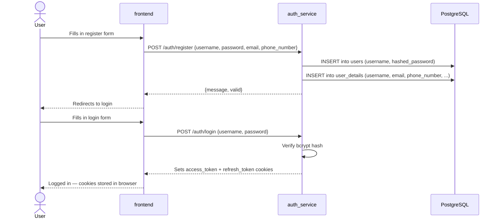

# User Management

This document explains how identity and user relationships work across GoClub as a whole. For endpoint-level detail see the [Auth API](auth/auth_api.md) and its [design doc](auth/auth_design.md).

## The User Lifecycle

```mermaid
sequenceDiagram
    actor User
    participant FE as frontend
    participant Auth as auth_service
    participant DB as PostgreSQL

    User->>FE: Fills in register form
    FE->>Auth: POST /auth/register {username, password, email, phone_number}
    Auth->>DB: INSERT into users (username, hashed_password)
    Auth->>DB: INSERT into user_details (username, email, phone_number, ...)
    Auth-->>FE: {message, valid}
    FE-->>User: Redirects to login

    User->>FE: Fills in login form
    FE->>Auth: POST /auth/login {username, password}
    Auth->>Auth: Verify bcrypt hash
    Auth-->>FE: Sets access_token + refresh_token cookies
    FE-->>User: Logged in — cookies stored in browser
```

From this point every request the browser makes carries the `access_token` cookie automatically. No service ever needs to call auth to validate it — each service decodes the token locally.

## Identity — `username` is the Universal Key

GoClub does not use integer user IDs. The `username` chosen at registration is the primary key in `users`, the primary key in `user_details`, the `sub` claim in every JWT, the `host` column in events, the `owner` column in groups, and `field1`/`field2` in the shared `requests` table.

This means every service can identify the caller from the token alone, and every inter-service call that references a user does so by username string.

## The Two-Table User Model

User data is split across two tables, both owned by the auth service:

| Table | Columns | Purpose |
|-------|---------|---------|
| `users` | `username`, `hashed_password` | Credentials only — needed for login |
| `user_details` | `username`, `first_name`, `last_name`, `email`, `phone_number` | Profile info — needed for display |

Both rows are written in the same transaction on registration. Splitting them keeps authentication logic (password hashing, token minting) separate from profile data (display names, contact info). The auth service is the only service that writes to either table.

## JWT Tokens

On login the auth service mints two tokens:

| Token | Claim `typ` | Lifetime | Purpose |
|-------|-------------|----------|---------|
| Access token | `access` | Short (minutes) | Proves identity on every request |
| Refresh token | `refresh` | Long (days) | Used to get a new access token when it expires |

Both are stored as `HttpOnly` cookies. The `sub` claim in both tokens is the `username`.

Every backend service decodes the access token locally using `decode_and_verify()` from `common/JWTSecurity.py`. The `typ` claim is validated on decode — a refresh token cannot be used in place of an access token. No service calls auth to check if a token is valid.

When the access token expires the frontend calls `POST /auth/refresh` with the refresh token cookie to get a new pair.

## Follows and Friends

The user service manages directional follow relationships, stored in the shared `requests` table as `FOLLOW_REQUEST` rows.

- **Follow**: Darren follows Cillian → one row, `field1=darren, field2=cillian, type=FOLLOW_REQUEST, status=ACCEPTED`
- **Friend**: Darren and Cillian are friends → two rows, one in each direction, both `ACCEPTED`

Friendship is derived — there is no separate friends table. The user service checks for bidirectional accepted follow rows to determine if two users are friends. This derived friendship is what other services use:

- Events `/inviteallfriends` — calls user service `/friends`
- Groups `/inviteallfriends` and `/friends_groups_exclusive` — calls user service `/friends`

## How Identity Propagates Across Services

Once logged in, the `username` extracted from the cookie flows through the entire system:

- **Circles** — `GET /mycircle` returns circle members for the authenticated user
- **Events** — `POST /create` sets `host = authorized_user` from the cookie; the event is permanently associated with the creator's username
- **Groups** — `POST /create` sets `owner = authorized_user` from the cookie
- **Proximity** — `POST /get_friends` calls circles `/mycircle` (forwarding the cookie) to get the circle, then filters nearby users to that set
- **`requests` table** — `field1` and `field2` are always usernames, so any row can be traced back to the users involved without a join to the users table