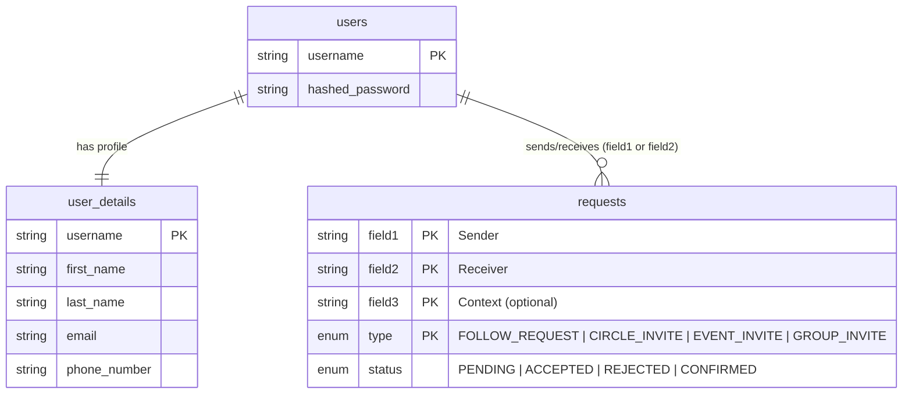
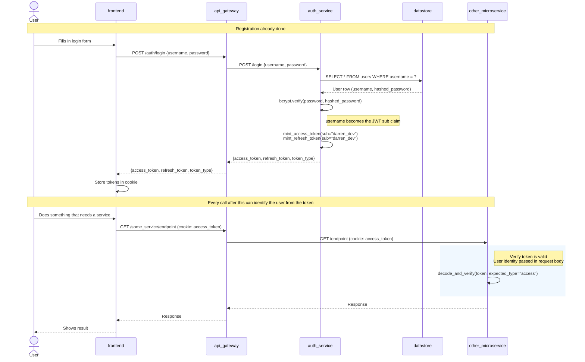
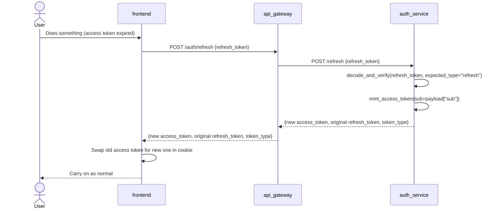

# User Management Design

## Registration

When a user registers, the service receives a `POST /register` request, checks that the username, email, and phone number aren't already taken, and then saves the data into two tables that only the auth service owns:

- **`users`** — stores the username and bcrypt-hashed password.
- **`user_details`** — stores the profile info (name, email, phone number).

Both rows are written in the same database transaction so you never end up with half a user. If any of the uniqueness checks fail, the endpoint returns `valid: false` with a plain English message rather than crashing with an error, so the frontend can show the user something useful.

## Database Schema (ER Diagram)

> **Note on `Status` enum:** The full enum defines `PENDING`, `ACCEPTED`, `REJECTED`, and `CONFIRMED`. However, no service currently uses `REJECTED` or `CONFIRMED` — all services only write `PENDING` and `ACCEPTED`. These values exist in the schema for future use.

### The `requests` Table — Composite Primary Key

Most tables use a single auto-incremented `id` as the primary key. The `requests` table does something different — it uses **four columns together** as the primary key: `(field1, field2, field3, type)`. This is called a composite primary key.

The way it works is that the database only rejects a new row if **all four values** match an existing row at the same time. Any single column on its own isn't unique — the uniqueness only applies to the full combination.

What this gives us in practice:

- Darren (`field1`) sending a `FOLLOW_REQUEST` to Cillian (`field2`) → one row, stored fine.
- Darren sending a `CIRCLE_INVITE` to Cillian → also fine, `type` is different so the combination is unique.
- Darren trying to send a **second** `FOLLOW_REQUEST` to Cillian → rejected, because all four values are identical to the row already there.

`field3` defaults to `""` (empty string) and is only needed for request types that have extra context, like `EVENT_INVITE` (which event?) or `GROUP_INVITE` (which group?). For `FOLLOW_REQUEST` and `CIRCLE_INVITE` it just sits there as `""` — it still needs to be part of the key, it just doesn't carry any meaning for those types.

## Token Strategy — JWT

JWTs are used to authenticate users across all services. The `username` is embedded in the token's `sub` claim and the whole thing is signed with a shared secret. Any microservice that gets a valid token can pull out the username without needing to call the auth service.

In practice, services that need to act on behalf of a user (like the circles service) receive user identity directly via the request body — `inviter` and `invitee` are passed explicitly rather than being read from the token. The token is used to verify the request is authenticated, not to identify the users involved in the operation.

### Token Types

| Type | Lifetime | Purpose |
|------|----------|---------|
| Access | Short (e.g. 15 min) | Prove who you are on each API call |
| Refresh | Long (e.g. 7 days) | Get a new access token without logging in again |

Both tokens include `iss`, `aud`, `sub`, `iat`, `exp`, and a `typ` field (`"access"` or `"refresh"`). The `typ` field is checked on decode so a refresh token can't be sneaked in where an access token is expected.

### Login Flow

## Token Refresh Flow

Access tokens are short-lived on purpose — if one gets stolen it expires quickly. When it runs out, the frontend uses the refresh token to get a new one without making the user log in again.

The refresh token stays the same — only a new access token is issued.

## Password Storage

Passwords are hashed with **bcrypt** via `passlib` before being written to the database. The plain-text password is never stored or logged anywhere. When checking a login, `CryptContext.verify()` handles the comparison in a timing-safe way so you can't guess passwords by measuring response times.

## Uniqueness Checks

Before creating a new user, the service checks each of the following separately and returns a clear message if any of them are already taken:

- `username` — must be unique in `users`
- `email` — must be unique in `user_details`
- `phone_number` — must be unique in `user_details`

These checks are also available as standalone endpoints (`/user_exists`, `/email_exists`, `/phone_number_exists`) so the frontend can validate individual fields in real time as the user is filling in the registration form.