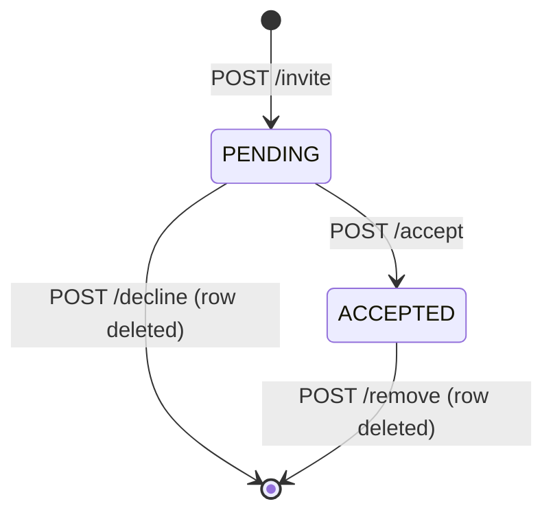

# Circle Service

A circle is a small, invitation-based group of users — think a close friend group. For simplicity, a user can only belong to **one** circle. The peer Group Service handles larger, multi-membership groupings.

**Base path:** `/circles`  
**Port:** 8002 (internal)

## Authentication

Endpoints that act on the authenticated user read identity from the `access_token` cookie. Endpoints that take explicit `inviter`/`invitee` in the request body do not enforce an auth guard.

## Endpoints

| Method | Endpoint | Request Body | Response |
|--------|----------|--------------|----------|
| POST | `/invite` | `inviter, invitee` | `message` |
| GET | `/get_invites` | — | `user_names[]` |
| GET | `/get_invites_sent` | — | `user_names[]` |
| POST | `/accept` | `inviter, invitee` | `message` |
| POST | `/decline` | `inviter, invitee` | `message` |
| GET | `/mycircle` | — | `user_names[]` |
| POST | `/remove` | `inviter, invitee` | `message` |

## Endpoint Notes

**`GET /get_invites`** — returns the usernames of everyone who has sent the authenticated user a pending circle invite.

**`GET /get_invites_sent`** — returns the usernames of everyone the authenticated user has invited who hasn't responded yet.

**`GET /mycircle`** — returns the usernames of everyone whose invite the authenticated user has accepted, i.e. the members of their circle.

**`POST /decline` and `POST /remove`** — both hard-delete the row from the database rather than transitioning to a `DECLINED` or `REMOVED` status. There is no record of the invite after either action.

## State Machine

