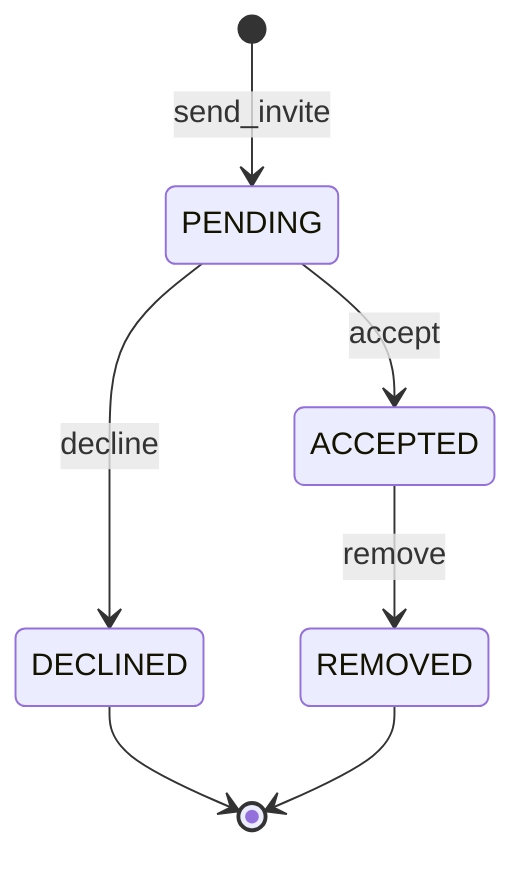

# Circles Service Design

Circles are the social core of the application: small, invitation-based groups representing close friendships. The defining data model decision is the invitation state machine. A circle membership passes through explicit states — invited, accepted, declined, removed — and the service enforces valid transitions. This prevents a user from appearing in circle queries before their invitation is accepted.

The circle boundary is also the privacy boundary for location sharing. Onlyaccepted circle members can see each other's positions in the Proximity service. The Circles service is the authority on membership; the Proximity service delegates that question rather than reimplementing it.

---

