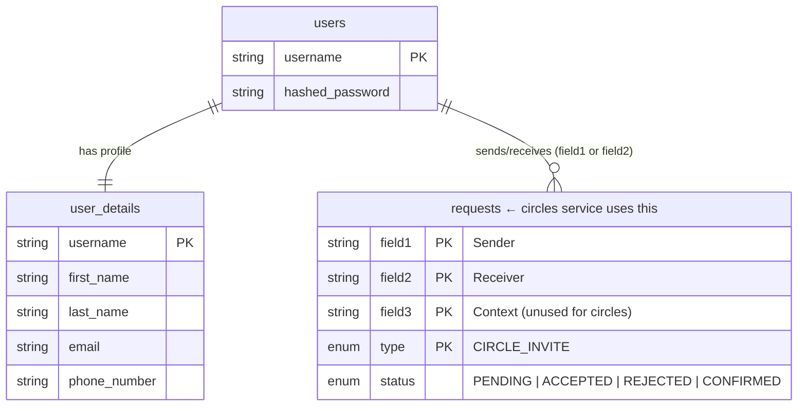
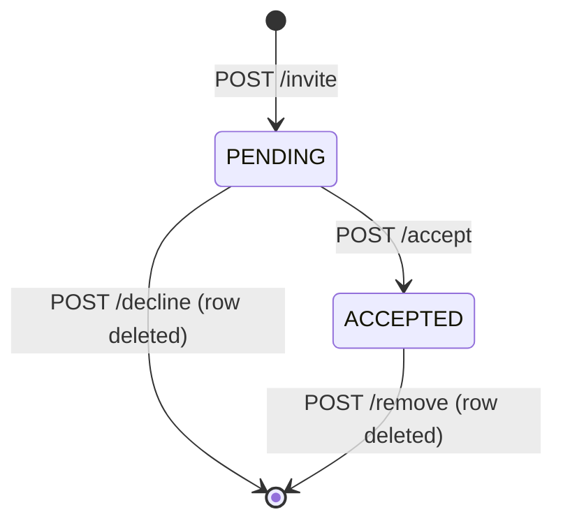

# Circles Service Design

A circle is a small, invitation-based group representing close friendships. A user can only belong to one circle. The peer Group Service handles larger, multi-membership groupings.

The defining design decision is the invitation state machine — a circle membership passes through explicit states (pending, accepted) and the service enforces valid transitions. This means a user never appears in circle queries before their invitation has been accepted.

The circle boundary also acts as the privacy boundary for location sharing. Only accepted circle members can see each other's positions in the Proximity service. The Circles service is the authority on membership; Proximity delegates that question to it rather than reimplementing the logic.

## Database Schema

The circles service does not own any tables — it reads and writes exclusively to the shared `requests` table. The `users` and `user_details` tables are shown for context but are owned by the auth service.

```mermaid
erDiagram
    users {
        string username PK
        string hashed_password
    }

    user_details {
        string username PK
        string first_name
        string last_name
        string email
        string phone_number
    }

    requests["requests ← circles service uses this"] {
        string field1 PK "Sender"
        string field2 PK "Receiver"
        string field3 PK "Context (unused for circles)"
        enum   type   PK "CIRCLE_INVITE"
        enum   status    "PENDING | ACCEPTED | REJECTED | CONFIRMED"
    }

    users ||--|| user_details : "has profile"
    users ||--o{ requests : "sends/receives (field1 or field2)"
```

## How Circles Work

The Circles service stores all its data in the shared `requests` table using `type = CIRCLE_INVITE`. There is no dedicated circles table — membership is entirely derived from the state of invite rows.

- To check if Cillian is in Darren's circle: query for a `CIRCLE_INVITE` row where `field1 = darren`, `field2 = cillian`, `status = ACCEPTED`.
- To get everyone in Darren's circle: query all `CIRCLE_INVITE` rows where `field1 = darren` and `status = ACCEPTED`, return `field2`.

Declining and removing are both hard deletes — the row is gone entirely. There is no `DECLINED` or `REMOVED` status stored in the database.

## Invite State Machine

```mermaid
stateDiagram-v2
    [*] --> PENDING : POST /invite

    PENDING --> ACCEPTED : POST /accept
    PENDING --> [*] : POST /decline (row deleted)

    ACCEPTED --> [*] : POST /remove (row deleted)
```

## Auth Notes

Endpoints that need to know who the logged-in user is (`/get_invites`, `/get_invites_sent`, `/mycircle`) read identity from the `access_token` cookie. 

Endpoints that take explicit `inviter` and `invitee` in the request body (`/invite`, `/accept`, `/decline`, `/remove`) do not currently enforce an auth guard — they trust the values passed in the body directly.