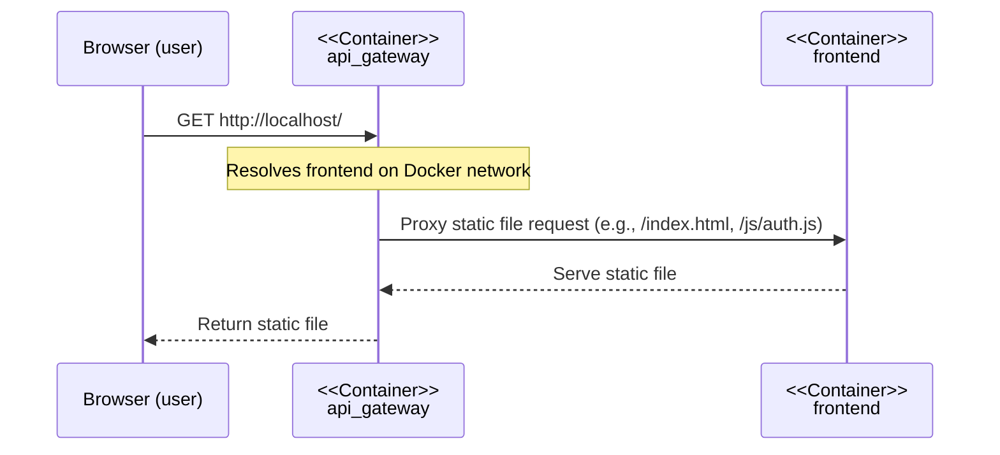
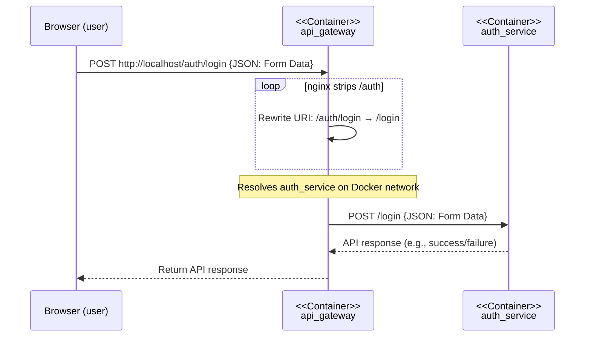

# End-to-End Flow

This document explains the request flow through the system using a Mermaid sequence diagram. Each lifeline is labeled with its container name for clarity.

## 1. Initial Page Load (Static Content)

## 2. User Clicks Login Button (API Call)

## Flow Explanation
- **Browser**: The user's web browser.
- **api_gateway (container)**: nginx reverse proxy, entrypoint for all requests.
- **frontend (container)**: Serves static files (HTML, JS, CSS).
- **auth_service (container)**: Handles authentication API requests.

1. **Initial Load**: The browser requests the main page. The gateway proxies this to the frontend container, which serves the static files.
2. **User Interaction**: When the user clicks the login button, the browser (via JavaScript) sends a POST request to `/auth/login`. The gateway proxies this to the auth_service container, which processes the login and returns a response.

This separation clarifies the difference between static content delivery and dynamic API interaction.
