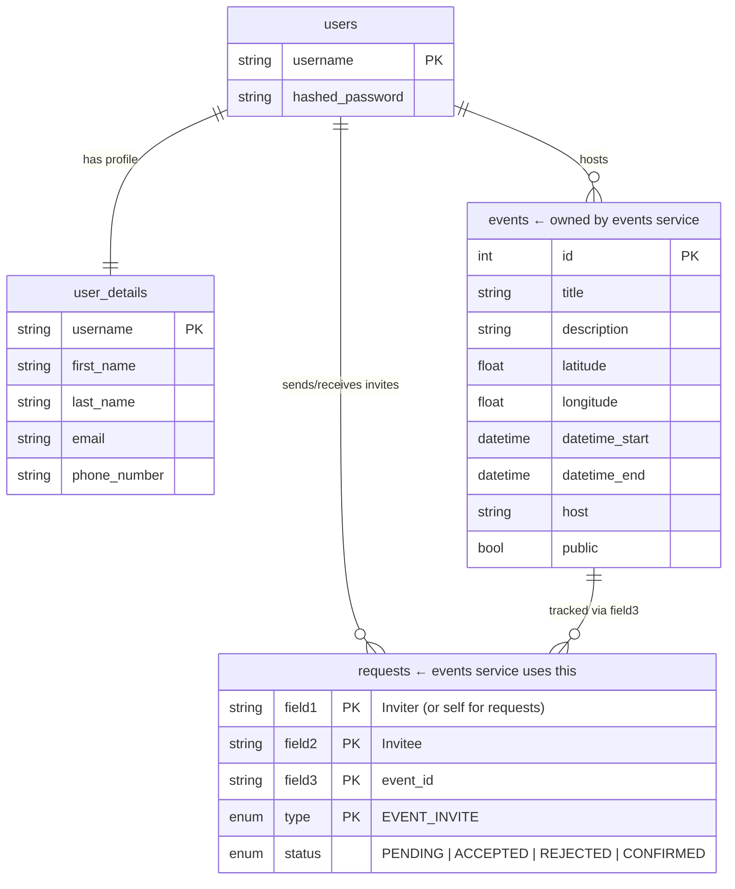
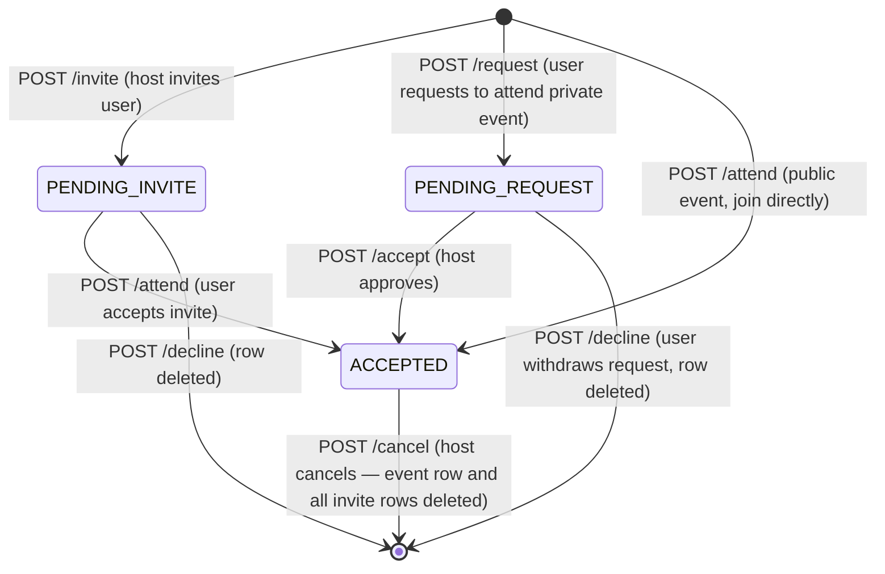

# Events Service Design

The events service handles event creation, invitations, attendance, and discovery. It is more complex than the circles service because events have two axes of variation: public vs private, and invited vs self-requested attendance.

## Database Schema

The events service owns the `events` table. For all invite and attendance tracking it writes into the shared `requests` table using `type = EVENT_INVITE`, with `field3` carrying the `event_id` — this is where `field3` earns its place in the composite primary key.



## Public vs Private Events

The biggest design split in the service is between public and private events — they follow completely different flows.

For a **public event**, anyone can join directly with no invite needed. Calling `/attend/{event_id}` inserts a row immediately with `status = ACCEPTED`.

For a **private event**, a user must either be invited by the host or request to attend and wait for the host to approve them.

## Invite vs Self-Request

The `requests` table distinguishes between an invite from someone else and a self-submitted attendance request using the `field1`/`field2` values. When Darren invites Cillian to an event:

```
field1 = "darren", field2 = "cillian", field3 = event_id
```

When Cillian requests to attend an event on their own:

```
field1 = "cillian", field2 = "cillian", field3 = event_id
```

`field1 == field2` is the signal that this is a self-request. The `is_requested()` helper in `events_database.py` checks for exactly this pattern. The `/my_invites` endpoint explicitly excludes self-requests by filtering `field1 != authorized_user`.

## Attendance State Machine



## Bulk Invites — Inter-Service Calls

Three endpoints invite multiple users at once by calling other services internally:

- **`/invitecircle/{event_id}`** — calls the Circles service (`/mycircle`) forwarding the cookie. Invites each circle member not already invited.
- **`/inviteallfriends/{event_id}`** — calls the User service (`/friends`) forwarding the cookie. Invites each friend not already invited.
- **`/invite_group/{event_id}/{group_id}`** — calls the Groups service (`/group_exists/{group_id}` then `/listmembers/{group_id}`). Available if the authenticated user is the host or the event is public.

## Cancellation

Cancelling an event (`/cancel/{event_id}`) is host-only and deletes both the event row from `events` and all associated `EVENT_INVITE` rows from `requests` in the same transaction.

## Geographic Search

The `/search` endpoint computes a bounding box from `latitude`, `longitude`, and `radius` (km) and filters within that rectangle. It is not a true radius/distance query — corners of the bounding box will be slightly further away than the radius.

There is currently a bug in the bounding box filter: the latitude and longitude range checks use Python's `and` operator instead of SQLAlchemy's `and_()`, meaning only one side of each comparison is actually applied to the SQL query. Results may be broader than expected until this is fixed.