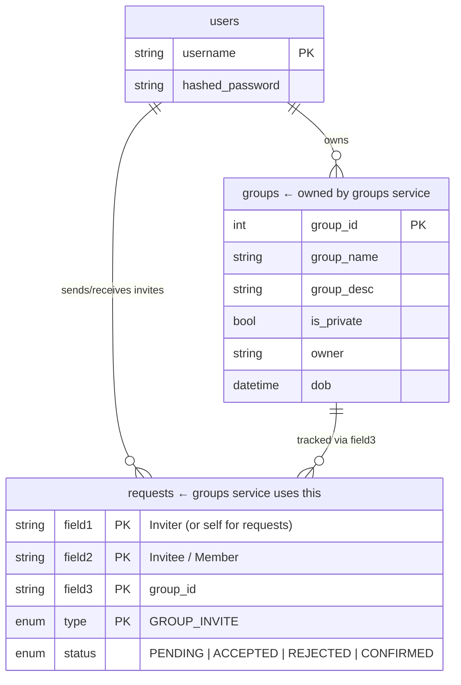
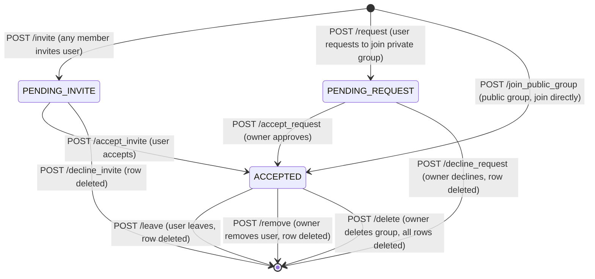

# Groups Service Design

Groups serve a different social function from Circles. Where a Circle is intimate and invitation-only, a Group is a community of shared interest that can be public or private. The distinction is set by the creator at the time of group creation and can be changed via `/edit`.

## Database Schema

The groups service owns the `groups` table. For all membership tracking it writes into the shared `requests` table using `type = GROUP_INVITE`, with `field3` carrying the `group_id` — the same pattern used by the events service with `event_id`.



## Public vs Private Groups

**Public groups** are open — any authenticated user can join directly via `/join_public_group/{group_id}`, which inserts a row immediately with `status = ACCEPTED`. No approval needed.

**Private groups** require either an invite from an existing member or a self-submitted join request that the owner must approve. Private groups still appear in `/list` — there is no visibility filtering currently.

## Invite vs Self-Request

The same `field1 == field2` pattern used in the events service applies here. When Darren invites Cillian to a group:

```
field1 = "darren", field2 = "cillian", field3 = group_id
```

When Cillian requests to join a group on their own:

```
field1 = "cillian", field2 = "cillian", field3 = group_id
```

The helpers `is_user_invited_to_group()` and `is_user_requested_to_join_group()` check for these two patterns respectively. `is_user_invited_at_all()` combines both checks and is used as a gate before inserting new invite or request rows to prevent duplicates.

## Membership State Machine



## Owner Controls

The group owner has exclusive authority over:

- Editing group details (`/edit`)
- Deleting the group (`/delete`) — removes the group row and all associated `GROUP_INVITE` rows
- Accepting and declining join requests (`/accept_request`, `/decline_request`)
- Removing members (`/remove`)

Any authenticated user can invite others via `/invite`, `/invitecircle`, or `/inviteallfriends`. Members can leave on their own via `/leave`.

## Bulk Invites — Inter-Service Calls

Two endpoints invite multiple users at once by calling other services internally:

- **`/invitecircle/{group_id}`** — calls the Circles service (`/mycircle`) forwarding the cookie. Invites each circle member not already invited or a member.
- **`/inviteallfriends/{group_id}`** — calls the User service (`/friends`) forwarding the cookie. Invites each friend not already invited or a member.

## Friends Group Discovery

`/friends_groups_exclusive` calls the User service to get the authenticated user's friends list, then finds all groups any friend belongs to, excluding groups the user is already in. This gives a social discovery feed — groups you might want to join based on what your friends are in.