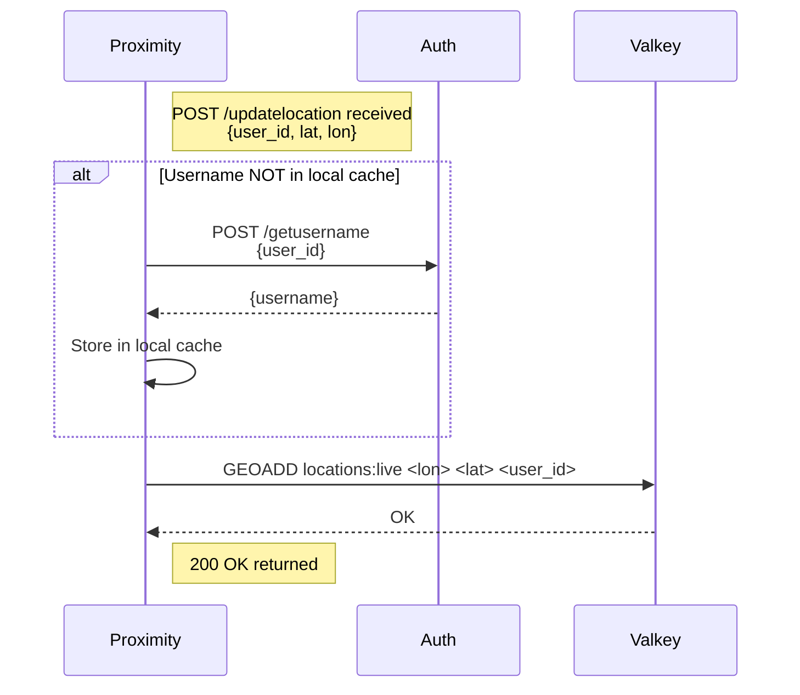
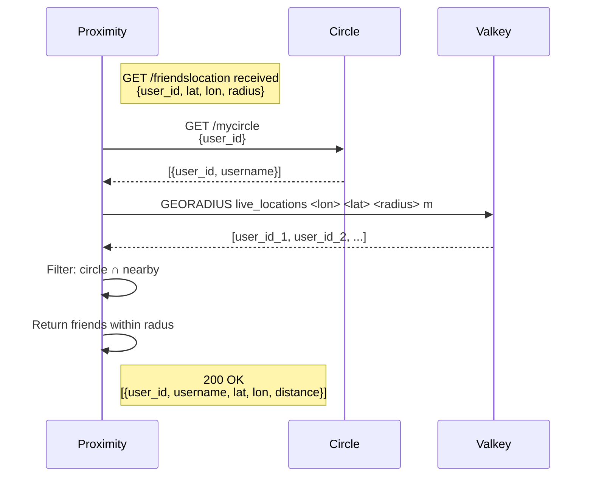

# Proximity Service

The Proximity Service offers the ability to a user to update its geolocation.
Holding all the locations of all users, the proximity service allows a specific user to retrieve the location
of friends in their circle.

## Why Valkey Over Standard Database?

**Valkey is chosen for the Proximity Service due to its specialized geospatial capabilities:**

1. **Built-in Geospatial Commands**: Valkey provides native `GEOADD`, `GEORADIUS`, and `GEODIST` commands optimized for location-based queries. A standard relational database would require complex mathematical formulas (like calculating distances on a sphere) or special plugins. Basically, you'd have to do a lot of extra work that Valkey already handles for you.

2. **Sub-millisecond Performance**: In-memory storage enables extremely fast reads/writes for location updates. Users update locations frequently (every few seconds while moving), the more users updating, the more of a bottleneck writing to the db on disk would becom..


3. **High Write Throughput**: Location updates are write-heavy. Valkey handles millions of writes/second, whereas traditional databases would require more elaborate solutions like connection pooling to handle.

4. **TTL Support**: Locations can auto-expire if users go offline (using `EXPIRE`), keeping data fresh without manual cleanup jobs.

## Sequence Diagrams

### Update Location


**Key Design:**
- **Geospatial key**: `locations:live` (global sorted set storing all user locations)
- **Username cache key**: `user:phonebook` (hash mapping user_id → username)
- Valkey command: `GEOADD user:locations <longitude> <latitude> <user_id>`
  - Note: GEO commands expect longitude first, then latitude
  - user_id serves as the member identifier in the sorted set

### Get Friends Inside Radius



```

## Notes

- Location updates should include timestamp expiry (e.g., `EXPIRE user:locations:<user_id> 3600`) to auto-remove stale locations
- Local username cache in Proximity service reduces Auth service calls

