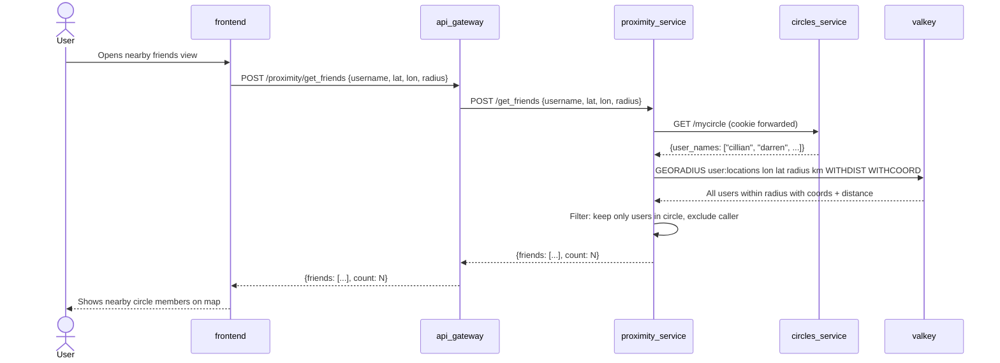

# Proximity Service Design

The Proximity Service tracks user locations and answers the question: *which of my circle are nearby right now?* It is the only service that doesn't use the shared PostgreSQL database — it runs entirely on **Valkey** (a Redis-compatible in-memory store), which is the right tool for this job for several reasons.

## Why Valkey Instead of a Database?

Every other service persists to PostgreSQL. The proximity service is different because location data has completely different characteristics:

**It changes constantly.** A user moving around updates their location every few seconds. Writing that to a relational database on disk at that frequency would create a bottleneck fast — Valkey handles millions of writes per second entirely in memory.

**It expires naturally.** If a user goes offline, their last known location becomes stale. Valkey supports TTL (time-to-live) expiry natively — you can tell it to delete a location entry automatically after an hour without needing a cleanup job. A database would require a scheduled task or trigger to do the same thing.

**It has built-in geospatial support.** Valkey's `GEOADD`, `GEORADIUS`, and `GEODIST` commands handle the spherical distance maths for you. Finding everyone within 2km of a given point is a single command. In PostgreSQL you'd either need the PostGIS extension or write the haversine formula yourself.

## Data Model in Valkey

The service uses two keys:

| Key | Type | Purpose |
|-----|------|---------|
| `user:locations` | Sorted Set (GEO) | Stores all user positions as geospatial members |
| `user:phonebook` | Hash | Maps `user_id → username` to avoid repeated auth service calls |

`GEOADD user:locations <longitude> <latitude> <username>` stores a location. Note Valkey GEO commands expect **longitude first, then latitude** — the opposite of most mapping conventions.

`GEORADIUS user:locations <longitude> <latitude> <radius> km WITHDIST WITHCOORD` returns everyone within the radius along with their distance and coordinates.

## How `/get_friends` Works

```mermaid
sequenceDiagram
    actor User
    participant FE as frontend
    participant API as api_gateway
    participant Prox as proximity_service
    participant Circles as circles_service
    participant Valkey as valkey

    User->>FE: Opens nearby friends view
    FE->>API: POST /proximity/get_friends {username, lat, lon, radius}
    API->>Prox: POST /get_friends {username, lat, lon, radius}

    Prox->>Circles: GET /mycircle (cookie forwarded)
    Circles-->>Prox: {user_names: ["cillian", "darren", ...]}

    Prox->>Valkey: GEORADIUS user:locations lon lat radius km WITHDIST WITHCOORD
    Valkey-->>Prox: All users within radius with coords + distance

    Prox->>Prox: Filter: keep only users in circle, exclude caller
    Prox-->>API: {friends: [...], count: N}
    API-->>FE: {friends: [...], count: N}
    FE-->>User: Shows nearby circle members on map
```

The key step is the intersection — Valkey gives back everyone nearby, the Circles service gives back circle members, and the proximity service returns only the overlap. This keeps each service focused on what it knows: Valkey knows location, Circles knows membership.