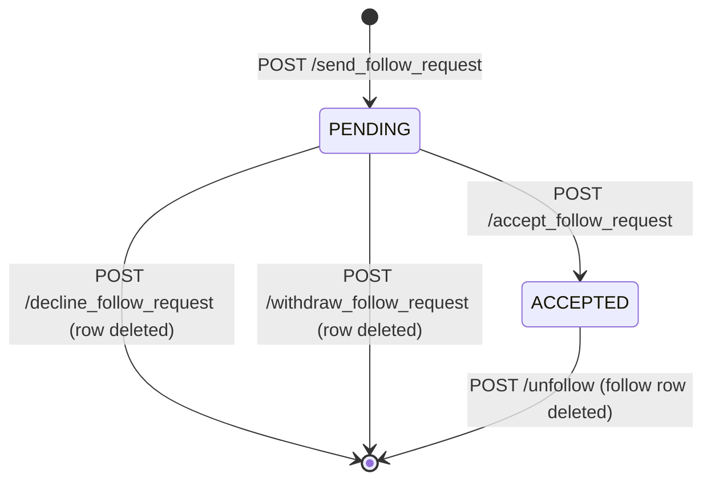

# User Service Design

The user service manages social relationships between users: follow requests, accepted follows, and derived friendships. It does not own a dedicated user profile table (that belongs to auth); instead it writes relationship state into the shared `requests` table using `type = FOLLOW_REQUEST`.

## Database Schema

The user service relies on auth-owned identity tables for usernames and stores relationship edges in `requests`.

```mermaid
erDiagram
    users {
        string username PK
        string hashed_password
    }

    user_details {
        string username PK
        string first_name
        string last_name
        string email
        string phone_number
    }

    requests["requests ← user service uses this"] {
        string field1 PK "Follower / requester"
        string field2 PK "Target user"
        string field3 PK "Context (unused for follows)"
        enum   type   PK "FOLLOW_REQUEST"
        enum   status    "PENDING | ACCEPTED | REJECTED | CONFIRMED"
    }

    users ||--|| user_details : "has profile"
    users ||--o requests : "sends/receives follows"
```

## Relationship Model

A follow is directional. If Darren follows Cillian, one accepted row exists:

- `field1 = darren`
- `field2 = cillian`
- `type = FOLLOW_REQUEST`
- `status = ACCEPTED`

Friendship is derived as bidirectional accepted follows. Two users are friends only when both directed rows exist and are accepted.

## Follow State Machine



## Endpoint Behavior Notes

- `GET /followers` returns all users where `field2 = me` and status is accepted.
- `GET /following` returns all users where `field1 = me` and status is accepted.
- `GET /friends` computes intersection of accepted outgoing follows with accepted incoming follows.
- `GET /search_users/{query}` performs case-insensitive username matching with `ILIKE`.
- `POST /unfollow` also removes circle invite rows in both directions for that user pair to keep circles aligned with unfollow.

## Auth Notes

Read endpoints that need caller identity use the `access_token` cookie. Several mutation endpoints take `inviter` and `invitee` in the request body and do not enforce a strict caller/body match in the service itself.

## Inter-Service Usage

Other services consume `GET /friends` to power social features:

- Events uses it for `/inviteallfriends/{event_id}`.
- Groups uses it for `/inviteallfriends/{group_id}` and `/friends_groups_exclusive`.
