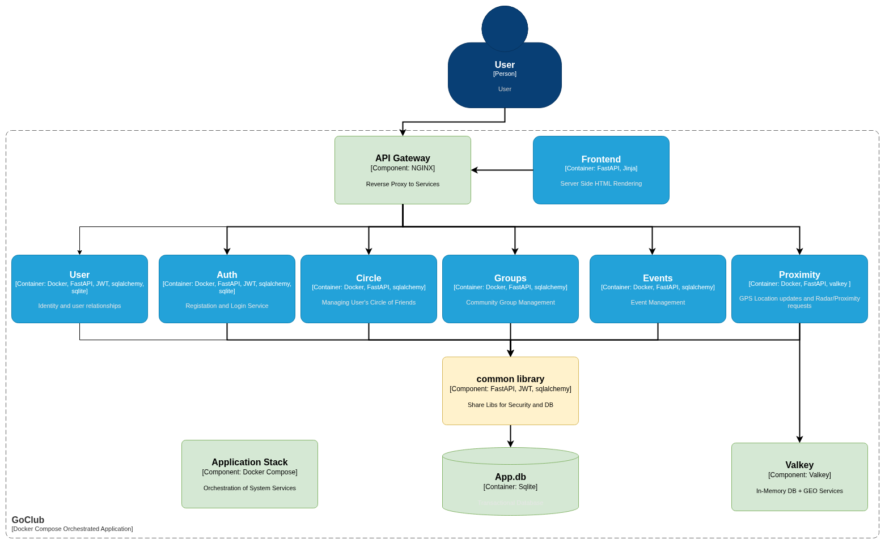
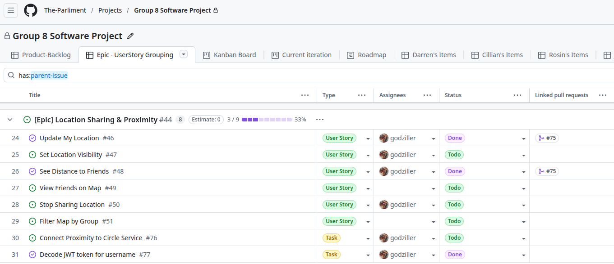
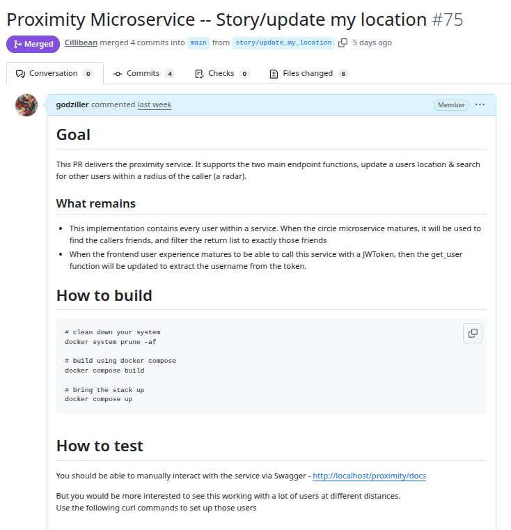
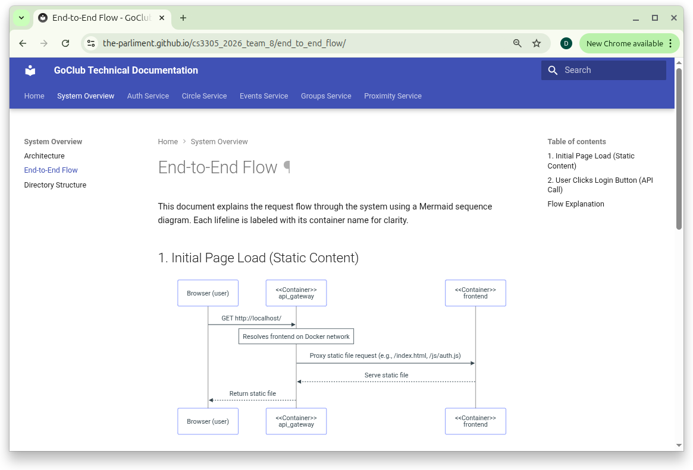
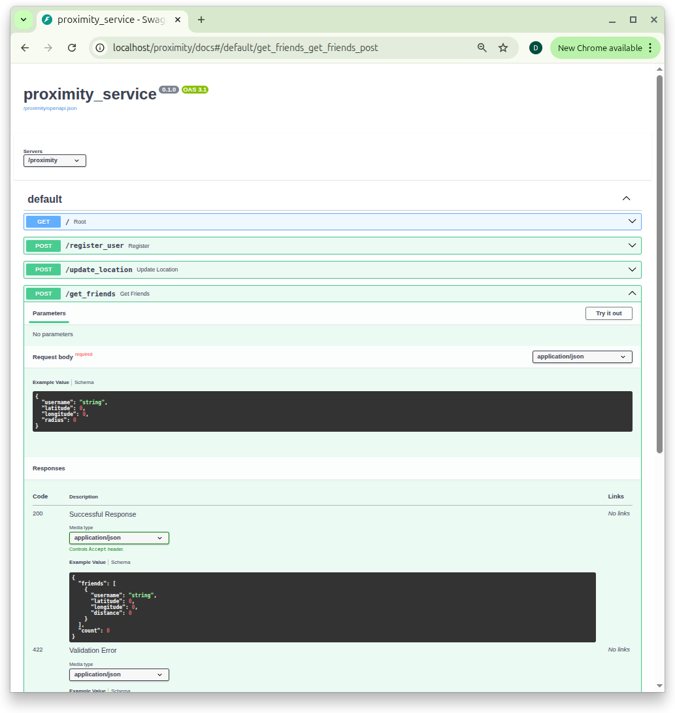

# GoClub Architecture Report

## Architecture of a Location-Aware Social Platform

---

### Authors

| Author | Student ID |
| -------- | ----------- |
| Joana Mafra | 123710151 |
| Darren Counihan | 123411792 |
| Cillian Ó Riain | 123512869 |
| Róisín Quinn | 123350046 |

### Group 8

March 2026

---

## Abstract

> This report documents the architecture of GoClub, a location-aware social
> platform built for CS3305 Team Software Project at University College Cork.
> It follows the narrative style of *The Architecture of Open Source Applications*
> — less concerned with what the system does, more with why it ended up the
> way it did.
>
> The full API documentation, data models, and service internals are kept
> separately at the project documentation site:
> [the-parliment.github.io/cs3305_2026_team_8](https://the-parliment.github.io/cs3305_2026_team_8/).
> This report doesn't reproduce any of that. What it tries to do is explain
> the thinking behind the decisions — the problems the team ran into and why
> they were solved the way they were.
>
> Three things ended up being harder than expected. Getting four developers
> building six services in parallel without constantly blocking each other.
> Making a seven-container system run the same way on every laptop, including
> on demo day. And figuring out what to do when the team realised that GPS
> coordinate data just doesn't belong in a relational database. Those three
> problems, and the architecture that came out of trying to solve them, are
> what this report is about.
>
> **All work presented is original and complies with university academic integrity standards**

---

# Introduction

Most student software projects, at their core, end up being a single service sitting on top of a database. GoClub is not that.

It is a location-aware social platform that depends on real-time data from active users, an event system with flexible visibility controls, a friend-circle model built around invitation state, and a wider community layer for broader group membership. All of these pieces need to work together, built by a team of four students under academic time pressure, across development environments that ranged from one laptop to another.

From early on, the team made a decision that shaped everything else: this project should be able to live beyond the deadline. Not as a finished product handed in and forgotten, but as something that could actually grow — an open source platform that other developers could pick up, extend, and build on. That goal changed how we approached things. A product needs a fancy UI. A platform needs clean boundaries, documented APIs, and an architecture that doesn't break when someone adds something new. GoClub was built to be the second thing.

Demo day made one thing clear: there are a lot of different ways to build a project. Some teams went deep on UI and visual polish, some built games, some leaned into AI libraries to create impressive-looking interfaces. GoClub had a working frontend — one person handled all of the look and feel, which was no small task — but the team's energy went somewhere else. The Jinja2 frontend exists to demonstrate the platform works, not to be the final word on how users interact with it. Someone could build a React app on top of the same API. Someone else could build an Android client. A third person could add a new backend service — a recommendations engine, a notification system, a chat feature — drop it behind the NGINX gateway, and the rest of the system would not need to change. Each service is its own container with its own boundary. That separation was one of the main goals of the architecture.

At the centre of the application is the idea of the *inner circle*: a small group of close contacts who share live location, making it possible to answer a simple spontaneous
question — who is nearby right now, and do they want to meet? Layered on top of this are Groups (communities based on shared interests) and Events (structured gatherings with RSVP and configurable visibility, similar in concept to Eventbrite but aimed at a university setting). The proximity feature alone opens up directions the current version doesn't explore — live event check-ins, location-triggered notifications, integration with mapping APIs for venue discovery. The architecture supports all of it without modification.

The most interesting part of this project is not the feature set though. It is the engineering decisions the team was pushed into making by three problems that turned out to be far more difficult than expected:

- coordinating parallel development across multiple services
- achieving reproducible environments and deployments
- handling high-frequency, real-time GPS data that did not fit the assumptions of a
  traditional relational database

This report tells the story of those three problems, and how the architecture evolved in response to them.

# Requirements and Constraints

## Functional Requirements

Six core capabilities drove how the system was split into services.

Users need to be able to register, authenticate, and manage their profiles. They need to form inner circles — small, invitation-only groups of close contacts. They also need to join and create broader Groups based on shared interests, and create, discover, and RSVP to Events with flexible visibility (public, private, circle-only, or group-only).

On top of this, the platform supports real-time location sharing within a user’s circle, allowing them to see who is physically nearby within a configurable distance.

The proximity feature introduces a constraint that none of the other features share: it requires continuous, high-frequency updates from active users. This has significant architectural implications and is explored in more detail in [Challenge Three](#challenge-three---when-the-database-is-the-wrong-tool).

## Non-Functional Constraints

**Team size** was the most consequential constraint. Four developers, each responsible for one or more services, with a fixed academic deadline juggling other course work. This created an immediate tension: microservices architecture enables parallel development, but it also introduces integration complexity and coordination overhead that a monolith avoids. Microservices don't give you parallel development for free — you have to set things up so people aren't constantly in each other's way.

**Deployment environment** was the second major constraint. The system needed to run identically on every team member's machine and produce a reliable demo. "It works on my machine" is not a viable outcome for a graded project. This constraint drove the containerisation decisions described in Section [Challenge Two](#challenge-two---reproducible-deployment-of-a-multi-service-stack).

**Privacy** was a real constraint, not an afterthought. Sharing real-time GPS coordinates with other users is sensitive. The architecture had to support granular controls: a user shares location with their circle but not with broader Groups or the public. This shaped both the data model and the JWT claims structure.

**Scope** was something the team had to be deliberate about from the start. Eight weeks, four people, and a system with a lot of moving parts meant some things had to wait. Production concerns like Kubernetes, JWT refresh and revocation, and async message queues were all on the radar — but getting a solid, working system across the line was the priority. The team made a conscious call to build a stable core first and leave the hardening for later.

# System Overview

GoClub is composed of six backend microservices, an API gateway, a shared common library, a Valkey in-memory cache, and a Jinja-templated frontend. All components are orchestrated by Docker Compose into a single deployable stack. The service decomposition maps directly to the six functional domains: Frontend, Auth, Circles, Groups, Events and Proximity.

{ width=90% }

Each service is a self-contained Python FastAPI application packaged as a Docker container, communicating with the outside world exclusively through the NGINX gateway. The common library is not a service; it is a shared Python package mounted into each service container at runtime, providing database session management, SQLAlchemy base models, and JWT processing utilities.

The gateway routes requests by URL path prefix. /auth/* goes to the Auth service, /circles/* goes to Circles, and so on. Adding a new service ended up being surprisingly simple — it mostly meant adding another rule to the NGINX config.

Valkey sits alongside the relational database as a second data tier, serving exclusively the Proximity service. Its role and the reasoning behind its selection are the subject of Section [Challenge Three](#challenge-three---when-the-database-is-the-wrong-tool).

# Challenge One — Coordinating Parallel Development

The microservices split wasn't originally about architecture trendiness. It came from a practical problem: four people trying to build six features at the same time without constantly waiting on each other. In earlier projects we had all experienced working on the same codebase and ended up blocking teammates during merges, so we deliberately tried something different here.

The team's response was three-layered: Agile process to align work to service boundaries, Git discipline to protect integration points, and documentation as a contract that enabled work to proceed before all services existed.

## Agile Process and the Mapping of Stories to Services

The team used [GitHub Projects](https://github.com/orgs/The-Parliment/projects/3) to track work using epics and user stories. The team tried to make sure story boundaries matched service boundaries. An epic for "Proximity Feature" decomposed into stories that could each be owned by a single developer: the Valkey integration, the location update endpoint, the nearby-users query, and the frontend map component. These stories could be worked on in parallel because their integration points were agreed upfront as API contracts, not figured out the hard way when everything tried to merge at once.



## Git Discipline and the Pull Request as Integration Gate

Each story lived on its own feature branch. Code only reached main through a pull request, which acted as the team's integration gate — the point where a change went from "works on my machine" to "works in the system." With 50+ tracked issues across the project, this wasn't optional. Branch names followed the story structure, so there was always a clear line from a tracked issue to the code that closed it. Keeping this up consistently across four people over 8 weeks, especially under deadline pressure, was harder than it sounds.

{ width=80% }

## MkDocs as a Development Contract

This ended up being one of the more useful process decisions in the project. The team adopted MkDocs not as a documentation deliverable to be produced at the end, but as a coordination tool used during development. Each service owner documented their API design — endpoints, request schemas, response structures — before or alongside implementation.

As the team had already been documenting APIs and designs in a `docs/` folder, adding a `mkdocs.yaml` took minutes — but the benefits far outweighed the effort.



MkDocs ended up being more useful than we expected because it packaged everyone's APIs into one searchable site — one place to check rather than hunting through files or waiting on a teammate to reply.
The consequence was significant: a developer building the Events service could code against the Circles API without the Circles service being complete, because the contract was written down and easily searchable. The documentation site became a substitute for a developer being physically available to answer questions. In a team working across different schedules and locations, this mattered more than it sounds — instead of waiting on someone to reply, you just checked the docs.

# Challenge Two - Reproducible Deployment of a Multi-Service Stack

With six backend services, an API gateway, a cache layer and a frontend, there were many ways things could break between machines. Python version differences, missing libraries, port conflicts, environment variable mismatches — any of these can produce a system that works on one developer's machine and fails silently on another's. For a project with a live demo requirement, this is not a theoretical risk; it is project-threatening.

## Container-Per-Service and the Isolation Benefit

Each service is its own Docker container built from its own Dockerfile. The container encapsulates the Python version, all dependencies, and the runtime configuration. A developer with no Python installed can run the full stack provided they have Docker. One service's dependency versions cannot conflict with another's because they never share a runtime environment.

Containerisation also helped prevent the kind of wasteful duplication that can plague collaborative development. In past group projects working from a monorepo, time pressure often led developers to work across shared code simultaneously, only to discover at merge time that teammates had rewritten the same sections — resulting in significant rework and lost effort. By isolating each service behind a well-defined boundary, containerisation acted as a natural forcing function against this pattern.

The common library is the one shared element. Rather than being installed as a package, it is bind-mounted into each service container from the repository root. A change to the common library is immediately reflected in all running services without a container rebuild — important during the early stages when the shared data models were evolving rapidly.

The learning curve with Docker Compose was real. In the first week we broke the network configuration several times and spent a full evening trying to figure out why containers could not see each other. Once it stabilised though, it became one of the most valuable parts of the project because everyone could run the exact same stack with a single command.

## NGINX as the Unifying Gateway

With six services running on six different ports, the frontend would otherwise need to know six different addresses. NGINX collapses this into one single address that handles everything.

```bash
server {
    listen 80;
    server_name _;

    # Proximity service: /proximity/* -> proximity container, strip /proximity prefix
    location /proximity/ {
        rewrite ^/proximity/(.*)$ /$1 break;
        proxy_pass http://proximity:8004/;
        proxy_set_header Host $host;
        proxy_set_header X-Real-IP $remote_addr;
        proxy_set_header X-Forwarded-For $proxy_add_x_forwarded-for;
        proxy_set_header X-Forwarded-Proto $scheme;
    }
```

But NGINX here is more than a convenience — it is a deliberate architectural layer, that's worth spelling out.
Because all traffic enters and exits through a single point, the backend services are completely decoupled from whoever is consuming them. The Jinja frontend is one client, but it does not have to be the only one. An Android app, an iOS app, or a third-party integration would talk to the same gateway, hitting the same endpoints, without any changes to the backend. For an open source project, this is significant — someone could pick up GoClub, discard the frontend entirely, and build their own on top of the same API without touching a single line of backend code.

The gateway also enables horizontal scaling in a way that a direct-to-service architecture does not. If the system came under load, spinning up additional instances of a high-demand service and load balancing across them at the NGINX layer is a configuration change, not an architectural one. The rest of the system would not notice.

Finally, the gateway represents a natural security boundary that the team did not fully exploit but deliberately left open. JWT validation could be centralised here — intercepting every inbound request, verifying the token before it reaches any service, and rejecting unauthorised traffic at the perimeter rather than relying on each service to do it independently. That was out of scope for this project, but the architecture supports it without modification.

## The Two-Phase Development Loop

A developer working on a new feature would run their service locally using a Python virtual environment and `uvicorn` — fast iteration, immediate Swagger UI feedback courtesy of FastAPI's automatic documentation generation, no Docker rebuild cycle. When the feature was stable, it was containerised and tested in the full stack via `docker compose up`.

Local development is faster but tests the service in isolation. Containerised development is slower but tests the service as the system will actually run. Keeping both modes viable avoided slow feedback loops during exploratory work while still catching integration issues before they reached main.

{ width=70% }

## The Nuclear Option

A multi-container system with persistent state can accumulate artefacts across restarts that mask bugs or produce inconsistent behaviour between team members. The team documented a full state-reset procedure as a first-class operation:

```bash
docker compose down --volumes --remove-orphans
docker system prune -af
sudo rm common/app.db
```

# The Core Services

Six services make up the GoClub backend — Auth, User, Circles, Groups, Events, and Proximity. The first five share a common character: they manage entities that change infrequently, have clear relational structure, and benefit from transactional consistency. Proximity is the exception and is covered in [Challenge Three](#challenge-three---when-the-database-is-the-wrong-tool). This section covers each of the five relational services, focusing on boundary decisions and architecturally notable design choices. Full API references and data model details are available at the MkDocs documentation site.

## Auth Service

Auth owns two things: identity and the shared `requests` table schema. Every other service writes into `requests` — it is the backbone of the entire social graph — but Auth is the service that defines it and owns the database transaction that creates a user.

The composite primary key on `requests` is the most interesting design decision here. Rather than a single auto-incremented id, four columns together form the key: `(field1, field2, field3, type)`. This means the same two users can have a `FOLLOW_REQUEST`, a `CIRCLE_INVITE`, and an `EVENT_INVITE` row simultaneously without any collision — uniqueness is enforced on the combination, not the individual fields. It was a deliberate choice that made every other service's job simpler.

JWT tokens are signed with a shared secret. Any service can verify a token locally without calling back to Auth — this was important for keeping services decoupled. The `typ` claim (`"access"` or `"refresh"`) prevents a refresh token being used where an access token is expected.

### Login Flow

```{.mermaid fig-cap="Auth's Login sequence flow"scale="1.0"}
sequenceDiagram
    actor User
    participant FE as frontend
    participant API as api_gateway
    participant Auth as auth_service
    participant DB as datastore

    User->>FE: Fills in login form
    FE->>API: POST /auth/login {username, password}
    API->>Auth: POST /login {username, password}
    Auth->>DB: SELECT * FROM users WHERE username = ?
    DB-->>Auth: User row (username, hashed_password)
    Auth->>Auth: bcrypt.verify(password, hashed_password)
    Auth->>Auth: mint_access_token(sub=username)<br/>mint_refresh_token(sub=username)
    Auth-->>API: {access_token, refresh_token, token_type}
    API-->>FE: {access_token, refresh_token, token_type}
    FE->>FE: Store tokens in cookie
    FE-->>User: Logged in
```

Full API reference and schema detail: [Auth Service — MkDocs](https://the-parliment.github.io/cs3305_2026_team_8/)

## User Service

The User service manages the social graph: follows, accepted follows, and derived friendships. It does not own a profile table — that belongs to Auth. What it owns is the relationship layer on top of Auth's identity tables.

### Database Schema

```{.mermaid fig-cap="User Service's Database Schema"}
erDiagram
    users {
        string username PK
        string hashed_password
    }

    user_details {
        string username PK
        string first_name
        string last_name
        string email
        string phone_number
    }

    requests["requests ← user service uses this"] {
        string field1 PK "Follower / requester"
        string field2 PK "Target user"
        string field3 PK "Context (unused for follows)"
        string type  PK "FOLLOW_REQUEST"
        string status   "PENDING | ACCEPTED"
    }

    users ||--|| user_details : "has profile"
    users ||--o{ requests : "sends/receives follows"
```

The key design decision is that friendship is not stored — it is computed. A follow is directional and stored as a single `FOLLOW_REQUEST` row. Two users are friends only when both directions exist and are accepted.

Table: **User service follow and friendship queries mapped to their underlying requests table logic**

| Query | How it works |
| --- | --- |
| `GET /followers` | All rows where `field2 = me` and `status = ACCEPTED` |
| `GET /following` | All rows where `field1 = me` and `status = ACCEPTED` |
| `GET /friends` | Intersection of accepted outgoing follows with accepted incoming follows |

This keeps the data model simple at the cost of a slightly more expensive friends query — an acceptable trade-off at this scale.

The User service is also the most consumed internal service in the system. Events, Groups, and Circles all call `/friends` to power their bulk-invite endpoints, making it a genuine shared dependency.

Full API reference: [User Service — MkDocs](https://the-parliment.github.io/cs3305_2026_team_8/)

## Circles Service

A Circle is the privacy boundary for location sharing. Only accepted circle members can see each other in the Proximity service — Proximity delegates that membership check to Circles rather than reimplementing it.

The interesting architectural choice is that the Circles service owns no tables. It reads and writes exclusively into the shared `requests` table using `type = CIRCLE_INVITE`. Membership is entirely derived from the state of invite rows — a user never appears in circle queries before their invite is accepted.

### Invite Flow

```{.mermaid fig-cap="Circle Service Invite Flow" scale="1.0"}
sequenceDiagram
    actor Darren
    actor Cillian
    participant API as api_gateway
    participant Circles as circles_service
    participant DB as requests table

    Darren->>API: POST /circles/invite {inviter, invitee}
    API->>Circles: POST /invite {inviter, invitee}
    Circles->>DB: INSERT CIRCLE_INVITE field1=darren field2=cillian status=PENDING
    DB-->>Circles: OK
    Circles-->>Darren: 200 invite sent

    Cillian->>API: POST /circles/accept {inviter, invitee}
    API->>Circles: POST /accept {inviter, invitee}
    Circles->>DB: UPDATE status=ACCEPTED WHERE field1=darren AND field2=cillian
    DB-->>Circles: OK
    Circles-->>Cillian: 200 now in circle

    Note over DB: Proximity can now see both users as circle members
```

Full API reference: [Circles Service — MkDocs](https://the-parliment.github.io/cs3305_2026_team_8/)

## Groups Service

Groups follow the same `requests` table pattern as Circles, with one addition: `field3` carries the `group_id`. A user can belong to many groups simultaneously, unlike circles where membership is exclusive.

### Groups' Database Schema

```{.mermaid fig-cap="Group Service's Database Schema" scale="0.5"}
erDiagram
    users {
        string username PK
        string hashed_password
    }

    groups["groups ← owned by groups service"] {
        int    group_id   PK
        string group_name
        string group_desc
        bool   is_private
        string owner
        datetime dob
    }

    requests["requests ← groups service uses this"] {
        string field1 PK "Inviter or self"
        string field2 PK "Invitee / Member"
        string field3 PK "group_id"
        enum   type   PK "GROUP_INVITE"
        enum   status    "PENDING | ACCEPTED"
    }

    users ||--o{ groups : "owns"
    users ||--o{ requests : "sends/receives invites"
    groups ||--o{ requests : "tracked via field3"
```

The public/private split drives most of the service complexity:

Table: **Group membership rules by visibility: how users join, request, and are invited across public and private groups**

| Behaviour | Public Group | Private Group |
| --- | --- | --- |
| Discoverable via `/list` | Yes | Yes |
| Join without approval | Yes — `status = ACCEPTED` immediately | No |
| Self-request to join | Not needed | Yes — owner must approve |
| Invite from member | Any member can invite | Any member can invite |
| Owner can remove member | Yes | Yes |
| Bulk invite circle/friends | Yes | Yes |

The Groups service makes inter-service calls to Circles and Users for the bulk invite endpoints (`/invitecircle`, `/inviteallfriends`). This was a deliberate choice to avoid duplicating membership logic that already existed elsewhere.

Full API reference: [Groups Service — MkDocs](https://the-parliment.github.io/cs3305_2026_team_8/)

## Events Service

Events is the most complex of the six services because it has two axes of variation: public vs private, and invited vs self-requested attendance. Every combination produces a different flow.

### Events' Database Schema

```{.mermaid fig-cap="Event Service's Database Schema" scale="0.5"}
erDiagram
    users {
        string username PK
        string hashed_password
    }

    events["events ← owned by events service"] {
        int      id             PK
        string   title
        string   description
        float    latitude
        float    longitude
        datetime datetime_start
        datetime datetime_end
        string   host
        bool     public
    }

    requests["requests ← events service uses this"] {
        string field1 PK "Inviter or self"
        string field2 PK "Invitee"
        string field3 PK "event_id"
        enum   type   PK "EVENT_INVITE"
        enum   status    "PENDING | ACCEPTED"
    }

    users ||--o{ events : "hosts"
    users ||--o{ requests : "sends/receives invites"
    events ||--o{ requests : "tracked via field3"
```

Table: **Event attendance flows by visibility: how users join, request, and are invited across public and private events**

| | Public Event | Private Event |
| --- | --- | --- |
| Attend directly | Yes — `POST /attend` → `ACCEPTED` immediately | No |
| Self-request attendance | Not needed | Yes — host must approve via `POST /accept` |
| Host invites user | Allowed but unnecessary | Primary mechanism |
| Bulk invite circle/friends/group | Yes | Yes — host only |
| Cancel event | Host only — deletes event row and all invite rows | Host only |

Like Groups, `field3` carries the `event_id` and the `field1 == field2` pattern is the consistent signal across the whole system for a self-request versus an invite from another user.

Full API reference: [Events Service — MkDocs](https://the-parliment.github.io/cs3305_2026_team_8/)

## Frontend Service

The frontend is a server-side rendered application built with FastAPI and Jinja2 templates. The honest reason for picking Jinja2 over React or anything similar was speed — one person was building the entire frontend alongside a full academic workload, and adding a JavaScript framework with its own build pipeline and tooling would have eaten time the project didn't have. Jinja2 runs inside the same FastAPI process the team was already using everywhere else, so there was no context switch, no separate dev server, no npm install breaking something at midnight before a deadline.

In terms of what it does, it plays the same role a React app would on the client side — handling all the page rendering, forms, navigation, and user interactions. The difference is that the HTML is built on the server and sent down complete, rather than being assembled in the browser. For a project at this scale that was the right call. The team got a working, navigable UI without the overhead of managing frontend state, API clients, or a separate deployment.

The more interesting architectural point is that the frontend is just one possible client. It talks to the backend through the same NGINX gateway an Android app would use, hits the same endpoints, and passes the same JWT tokens. Nothing about the backend knows or cares that the client is Jinja2. Swapping it out for a React frontend or a mobile app would require zero changes to any backend service — the gateway handles everything in between.

WTForms handles form validation server-side, keeping that logic where it belongs and out of the individual backend services. The  `require_frontend_auth` dependency gates any route that needs a logged-in user — missing or invalid token gets redirected to login before the handler even runs.

## Technologies & Tools

The following table is a collection of all the technologies and tools we leveraged throught this project.

Table: **Technologies and tools used across the GoClub stack**

| Technology / Tool | Purpose in GoClub |
| --- | --- |
| Python | Everything is Python — all services, the common library, the frontend. It's what the team knew. |
| FastAPI | Microservice API framework. Swagger UI auto-generation was useful for testing before the frontend existed. |
| Uvicorn | ASGI server that runs FastAPI, both locally and inside containers. |
| SQLAlchemy | ORM used across all services. Models defined once in the common library, used everywhere. |
| SQLite | Stores all durable data — users, circles, groups, events, memberships. One shared file. |
| Valkey | In-memory geospatial store for the proximity service. Handles GPS data in a way SQLite cannot. |
| redis-py | Valkey client. Valkey is Redis-compatible so the standard Python Redis client works unchanged. |
| NGINX | API gateway and reverse proxy. Single entry point that routes traffic to the right service by URL prefix. |
| Docker | Each service runs in its own container. Solved the "works on my machine" problem. |
| Docker Compose | One command to bring up the entire stack. The canonical way to run GoClub. |
| Jinja2 | Server-side templating for the frontend service. |
| WTForms | Frontend form validation, keeping that logic out of the backend services. |
| HTTPX | HTTP client for service-to-service calls, e.g. Proximity calling Circles. |
| PyJWT | JWT encode and decode across all services. |
| Passlib + bcrypt | Password hashing. Passwords are never stored in plain text. |
| python-dotenv | Loads environment variables locally so secrets aren't hardcoded. |
| MkDocs + Material | Turned /docs markdown into a searchable site. Used as a live development contract during the project. |
| Mermaid | Sequence diagrams and ER diagrams throughout the docs and this report. |
| Git + GitHub | Version control, branching, PRs, issues — the whole workflow ran through GitHub. |
| GitHub Projects | Tracked epics and user stories mapped to service boundaries. |
| OpenAPI / Swagger UI | Auto-generated by FastAPI. Made endpoint testing possible before the frontend was ready. |
| Draw.io | System architecture diagram. |

# Challenge Three - When the Database Is the Wrong Tool

Every service in the [Core Services Section](#the-core-services) fits comfortably into the same data model: SQLAlchemy-managed tables in SQLite, accessed through the common library. Users, circles, groups, events, memberships — these change infrequently, have stable relational structure, and benefit from ACID guarantees.

GPS coordinates do not fit this model. Understanding why, and finding a better tool for the problem, is what this section covers.

## The Problem with GPS Location in a Relational Database

Early on we briefly considered putting location data into SQLite alongside the other services. After a quick prototype it became obvious that this was a bad idea — writes started blocking almost immediately once multiple users updated locations.

Every active user sends a position update at high frequency — potentially every few seconds. In a realistic scenario with twenty concurrent active users, that is twenty writes per second.  SQLite uses file-level locking — only one write at a time. With twenty users pinging updates every few seconds, they'd be queuing behind each other, and that latency would be immediately visible.

The read side is equally problematic. A proximity query — "which of my circle members are within 500 metres?" — requires computing the spherical distance between the querying user's coordinates and every other active user's coordinates. This involves expensive mathematical operations across every row in the active-user set. Without a spatial index this becomes a full-table scan on every proximity request.

A further mismatch: location data has no meaningful persistency requirement. If the application restarts, users send a fresh position within seconds of reconnecting. Forcing volatile state into durable storage solves a problem that does not need to be solved.

## The Research Process and the Discovery of Valkey

Rather than building a custom solution, the team stepped back and asked what the data actually needed — then searched for tools built for exactly that.

The tool needed to do four things: keep data in memory for speed, handle geospatial queries natively, expire stale positions automatically, and handle high write volume without locking.

Redis already had all of this built in through its geospatial command set. `GEOADD` stores a coordinate under a named key. `GEODIST` computes distance between two stored points, applying complex math formula internally. `GEOSEARCH` returns all stored points within a given radius. The spherical geometry that would have required significant custom implementation is a single
command.

We chose Valkey over Redis because it felt more in line with the spirit of the project. When Redis changed their license in 2024, the community forked it into Valkey to keep it truly open. Honestly, we picked it because it sounded cooler—a bit more anarchist, backed by the Linux Foundation, and a direct 'thumbing of the nose' at the rug-pull. Technically, it was a perfect drop-in; we got the native GEOADD and GEORADIUS commands we needed for high-frequency GPS data without changing a single line of the Redis Python client.

### Update Location

```{.mermaid fig-cap="Proximity Service's User GPS Location Update Flow"}
sequenceDiagram
    participant Proximity
    participant Auth
    participant Valkey

    Note right of Proximity: POST /updatelocation received<br/>{user_id, lat, lon}

    alt Username NOT in local cache
        Proximity->>Auth: POST /getusername<br/>{user_id}
        Auth-->>Proximity: {username}
        Proximity->>Proximity: Store in local cache
    end

    Proximity->>Valkey: GEOADD locations:live <lon> <lat> <user_id>
    Valkey-->>Proximity: OK

    Note right of Proximity: 200 OK returned
```

### Get Friends Inside Radius

```{.mermaid fig-cap="Proximity Service's Friends Radar Service"}
sequenceDiagram
    participant Proximity
    participant Circle
    participant Valkey

    Note right of Proximity: GET /friendslocation received<br/>{user_id, lat, lon, radius}

    Proximity->>Circle: GET /mycircle<br/>{user_id}
    Circle-->>Proximity: [{user_id, username}]

    Proximity->>Valkey: GEORADIUS live_locations <lon> <lat> <radius> m
    Valkey-->>Proximity: [user_id_1, user_id_2, ...]

    Proximity->>Proximity: Filter: circle ∩ nearby

    Proximity->>Proximity: Return friends within radius

    Note right of Proximity: 200 OK<br/>[{user_id, username, lat, lon, distance}]
```

## The Resulting Two-Tier Data Architecture

The Valkey integration pushed the project toward two separate data tiers.

**SQLite with SQLAlchemy**, managed through the common library, serves all durable, relational, slowly-changing data: user accounts, circle memberships, group memberships, events, RSVPs. This is the system of record.

**Valkey** serves short-lived, high-frequency, spatially-indexed data: the current position of active users. Data carries a TTL and expires automatically when a user goes offline. No explicit delete logic is required.

In practice, this gave the project two data tiers: SQLite for durable relational data, and Valkey for short-lived geospatial data. It made more sense to use an existing tool rather than building our own implementation.

# Cross-Cutting Concerns

## The Common Library

In a typical microservices setup, each service is fully self-contained with its own database client, authentication logic, and data models. This is correct for large services deployed independently by separate teams. It is the wrong design for a small team building six services that share a single database schema and a single JWT secret.

The common library provides three things: SQLAlchemy base models and session management used by all services to access the shared database; Pydantic schemas for data structures that cross service boundaries; and JWT encode/decode utilities. By centralising these, the team avoided independent implementations of the same boilerplate and ensured that a change to a shared model propagated to all services simultaneously.

The trade-off is worth noting: a breaking change to the common library is a breaking change to all services. In a system where services are built and deployed independently, this would be a serious problem. In this system, where all services deploy together via a single docker compose up, it is not a liability — For this project, that tradeoff made sense.

## JWT and Distributed Authentication

Token verification is local in each service. The JWT payload carries the user's identity and any claims needed for access decisions downstream. No network round-trip to the Auth service is required on each request, removing both a latency cost and a dependency on Auth availability for every other service to function.

Token revocation and refresh tokens were deliberately left out of scope — both add meaningful complexity that was not justified given the scale and expected lifetime of this project.

# Future Improvements

## User Lifecycle and the Case for an Event Bus

GoClub currently runs with a single shared `app.db` SQLite file. All services read and write to the same database, which means a user deletion today is straightforward — the record is gone, and every service sees that immediately because they are all looking at the same file.

This works for now, but it is not the microservices pattern. The proper next step would be giving each service its own database. Circles owns its membership tables. Groups owns its rosters. Events owns its RSVPs. No shared file, no shared schema.

That change introduces a problem that does not exist today: when a user is deleted, how does every service find out? Auth owns the deletion, but it cannot reach into Circles' database or Groups' database to clean up — that would break the service boundary entirely.

The answer is an event bus. Auth publishes a `user.deleted` event. Every other service subscribes and handles its own cleanup within its own database boundary. Circles removes memberships. Groups removes the user from rosters. Events cancels RSVPs. Each service reacts independently, and Auth does not need to know or care what any of them do with the information.

The infrastructure is already there — Valkey supports pub/sub natively and is already running in the stack. The event bus is the natural next step as GoClub moves toward each service truly owning its data.

## NGINX Could Do a Lot More

At the moment NGINX just routes traffic. It doesn't validate tokens, it doesn't rate limit, it doesn't do anything clever. Each service checks the JWT itself, which means a bad request travels all the way to a service before getting rejected.

Moving token validation to the gateway would fix that, and adding rate limiting on top would give some basic protection against being flooded with requests. Neither of these is complicated — we just ran out of time.

## Proximity Service — Caching Circle Membership

Every call to `/get_friends` makes a blocking HTTP request to the Circles service to fetch the caller's circle membership before it can filter the nearby users returned from Valkey. This happens on every single proximity request — even though circle membership almost never changes. A user's circle is something they set up once and rarely modify. Calling across a service boundary to retrieve the same data repeatedly is unnecessary work.

The fix is already sitting in the stack. Valkey supports TTL-based expiry natively, and the Proximity service already has a Valkey client. Circle membership for a given user can be written into Valkey on first request and given a TTL — say, five minutes. On subsequent requests, Proximity reads from the local cache and skips the network call entirely. When the TTL expires, the next request goes to Circles, refreshes the
cache, and the cycle repeats.

The result is that the Circles service is called occasionally rather than constantly, and the proximity hot path — which is called at high frequency by active users — no longer depends on a cross-service round trip on every invocation. The data served is at most five minutes stale, which is an entirely acceptable trade-off for data that changes as infrequently as circle membership does.

## Common Library — From Bind Mount to Published Package

The common library is currently shared across all services via a bind mount — a directory on the host machine is mapped into each running container at runtime. This works perfectly within Docker Compose on a local machine, but it carries a hidden assumption: the host filesystem is always there. The moment you try to push individual service images to DockerHub and run them independently, the bind mount is gone and every service breaks. The images are not self-contained.

The correct solution is to turn common into a proper Python package. A `pyproject.toml` at the root of the common directory is all that is needed to make it installable. Each service's Dockerfile would then include a `pip install` step that pulls the package in at build time — either from a private PyPI registry, directly from the GitHub repository, or via a local path install during the build context.

```dockerfile
# Install common library directly from source during image build
COPY ./common /common
RUN pip install /common
```

The result is that each service image becomes self-contained. No bind mount, no assumption about the host, no Docker Compose dependency. An image pushed to DockerHub would run anywhere — a teammate's machine, a cloud VM, a Kubernetes cluster — without modification.

## Priority Two API Completion

Not everything that was designed got built. This was intentional. Early in the project the team categorised API endpoints as Priority One (core functionality, required for a working system) and Priority Two (enhancements, descoped under time pressure). The descoped work is tracked in the team's GitHub Project board as open issues — the work is visible, understood, and waiting. It's not unfinished — it's just next.

# Lessons Learned

## Intentional Architecture Beats Accidental Architecture

Every project we'd done before this one followed the same pattern — nobody wanted to spend time on design upfront, so everyone just started building. It always felt like the faster option. It never was. You'd get a few weeks in and realise two people had solved the same problem in completely different ways, or that a decision one person made quietly had broken something someone else was building. By the time you found out, both things were half-finished and untangling them was a nightmare.

With GoClub we tried something different. Before anyone wrote much code, we sat down and agreed on a folder structure, a service layout, and built one complete working microservice that everyone else could copy from. At the time it felt like we were putting off the real work. Looking back it was probably the most useful thing we did. Every service that came after had a template — the Dockerfile, how the common library plugged in, how the routes were laid out. Nobody had to figure any of that out from scratch.

There's a concept called Conway's Law — the idea that teams tend to build systems that look like how they're organised. We'd seen this go wrong before. This time we tried to flip it — agree the service boundaries first, then divide ownership around them. One person, one service. It didn't eliminate confusion but it made it a lot easier to figure out whose problem something was when things went sideways.

Brooks called this conceptual integrity — a system that feels like it came from one mind even when it didn't. We didn't fully get there, but we got closer than we would have otherwise.

## Make the Environment a First-Class Artefact

Getting docker-compose.yml working early and keeping it working was one of the better calls we made. Every developer could bring up the full stack with one command from day one. That sounds obvious but in previous projects it was always the thing that blew up the week before the deadline — someone's machine had the wrong Python version, a dependency conflicted with something, a config file lived on one person's laptop and nowhere else.

Brooks writes about how software projects bleed time in ways nobody plans for. Environment problems are a big part of that. Sorting Docker Compose out early meant those problems showed up when there was still time to fix them, not the night before the demo.

## Documentation Written During Development is a Design Tool

From pretty early on, each of us kept a markdown file in /docs describing our service — what the endpoints were, what they took, what they gave back. Nothing fancy, just a file in the repo that got updated when things changed. It wasn't always perfect but it meant there was always somewhere to look instead of having to message someone and wait.

Midway through we added MkDocs, which took everything in /docs and turned it into a proper searchable site. That sounds like a small thing but the difference was bigger than expected. What had been a personal reference became something the whole team actually used day to day. You could find the Circles API without digging through three folders or waiting on a WhatsApp reply at midnight.

The APIs changed during the project — this wasn't a locked spec everyone followed blindly. But having things written down meant when something changed, people found out from the docs rather than from something breaking in their service. That's a much better way to find out.

Same Conway's Law point applies here — if your architecture reflects how you communicate, then docs are what stop that communication from depending on everyone being online at the same time. The docs worked at 2am just as well as they worked during the day.

## Git Discipline and the Cost of Integration

Brooks's Law — adding people to a late project makes it later — is really about communication overhead. The more people, the more places things can clash, and if you leave merging until the end it gets painful fast. The PR workflow kept that manageable. Nothing hit main without going through a review, so integration happened in small pieces all the way through rather than all at once in a horrible session at the end.

The project board helped too. Keeping stories tied to service boundaries meant two people were rarely in the same code at the same time. It didn't always work — there were still moments where things clashed — but it was miles better than everyone working off a shared branch and hoping for the best, which is what had happened before.

If you don't manage your boundaries on purpose, the codebase ends up encoding the mess for you. Keeping the branch discipline going across eight weeks and four people, especially near deadlines, was harder than it looks from the outside. But letting it slip would have been worse.

## Reach for the Right Tool Before You Build Your Own

The Valkey decision is the clearest example of this. We could have tried to make SQLite handle GPS data. It would have meant writing custom spatial logic, managing TTLs manually, and fighting SQLite's write locking every time multiple users updated their location at once. That's a lot of work to build something that would still have been worse than what Valkey gives you for free. One pip install and GEOADD, GEORADIUS did the job.

Brooks talks about the tendency to over-engineer things when a problem looks familiar enough to have a go at yourself. The proximity feature could easily have gone that way. Stopping to ask whether the problem was already solved somewhere saved a lot of time and produced something better than we'd have written from scratch.

## Microservices is a Process Decision as Much as a Technical One

We initially chose microservices to enable parallel work, but the reality on the ground was much more linear. In practice, our workflow often looked like a relay race: one person would build the "walking skeleton" of a service, and then someone else would come in to provide the necessary improvements, security hardening, or database optimizations.

While we tried to respect service boundaries, we did "poke" into each other's codebases—but we did it through this hand-off process rather than just chaotic interference. This linear fashion of working actually saved us; it meant that while one team member was establishing the core Auth logic, another could be ready to step in and integrate the Events Service immediately after. It wasn't the "six services in perfect sync" that you see in textbooks, but it was the only way we could maintain a consistent quality level across the whole system given our timeframe. Getting four people to coordinate these hand-offs without breaking the overall design was the real architectural challenge.

# Conclusion

Eight weeks ago none of us had built anything close to this. A working microservices platform, containerised, documented, with a live demo that actually ran on the day.

It didn't go smoothly. There were nights where the Docker network was broken and nobody knew why, PRs that sat too long and caused merge pain, and more than one moment where the whole stack just refused to come up. The nuclear option got used more than once.

The three challenges this report covers were the ones that shaped everything else — getting parallel development to work without stepping on each other, making the stack run the same way on four different machines, and figuring out that SQLite was the wrong tool for GPS data before it became a much bigger problem. None of those were obvious going in.

GoClub isn't finished. There's a list of open issues on the board that didn't make the cut. But it's in a state where someone could pick it up, read the docs, and understand what they're looking at. For a student project built in eight weeks, that feels like enough.

# Project References

- **GitHub Source:** <https://github.com/The-Parliment/cs3305_2026_team_8>
- **MkDocs Documentation:** <https://the-parliment.github.io/cs3305_2026_team_8/>
- **GitHub Project:** <https://github.com/orgs/The-Parliment/projects/3/views/7>

# Contributors

GoClub was a genuine team effort. While each person led on specific services and areas, everyone contributed beyond their own boundaries — reviewing each other's code, debugging shared infrastructure, and picking up whatever the project needed at the time.

**Cillian**

- Contributed to the creation, development, and finalization of each microservice except for Proximity. This involved writing all CRUD logic in the backend, as well as implementing the correct Jinja structure and syntax in the frontend.
- Worked with Joana to create the design of the UI and the flow of user stories. Worked with Darren to implement the frontend of the proximity service as well as the Groups microservice. Worked with Roisin to implement the Events and Circles microservices. Designed and implemented the finalized Auth microservice.


**Róisín**

- Contributed to the design and implementation of both Events and Circles microservices, including writing API endpoints and routes for event creation, editing, deletion and invitations, as well as for inner circle editing and invitations.
- Assisted in the integration of the Events + Invites backend microservices to the frontend so that they could be reliably accessed through the user interface.

**Joana**

- Designed and planned the UI and flow of the user stories, drawing the logos, icons, and choosing an adequate colour palette.
- Implemented said design using HTML, CSS, and JavaScript, and organized the HTML pages. Overall main frontend developer and frontend designer.

**Darren**

- Designed and implemented the Proximity microservice, integrating Valkey for real-time geospatial queries.
- Designed and implemented the Groups microservice, including DB schema, endpoints, and API gateway wiring.
- Established the project infrastructure including directory structure, Docker Compose orchestration, NGINX gateway, and MkDocs documentation site.
- Set up GitHub Projects with Epic and User Story structure to coordinate parallel development across the team.
- Contributed to the frontend map overlay, implementing live GPS pin display and friend location tracking.
- Deployed the stack to AWS EC2, validating end-to-end geolocation in a live environment.
