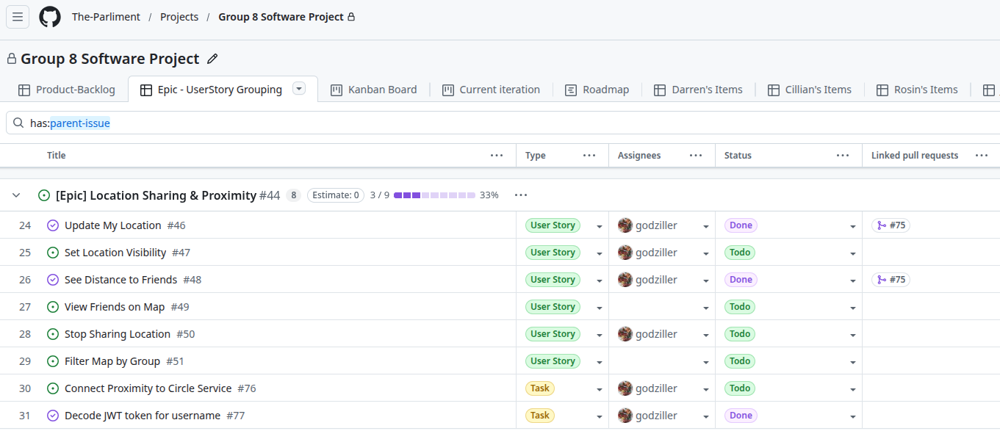
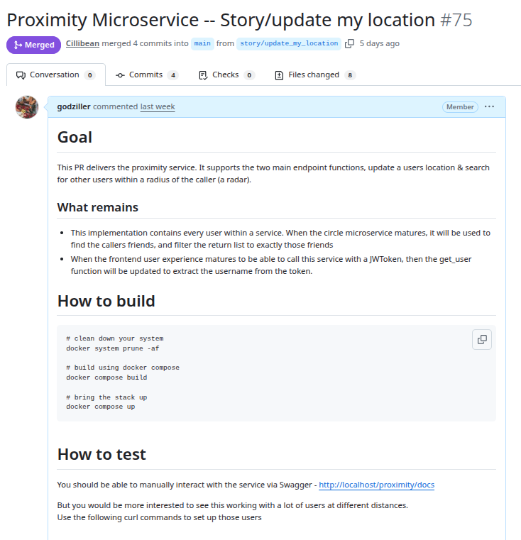
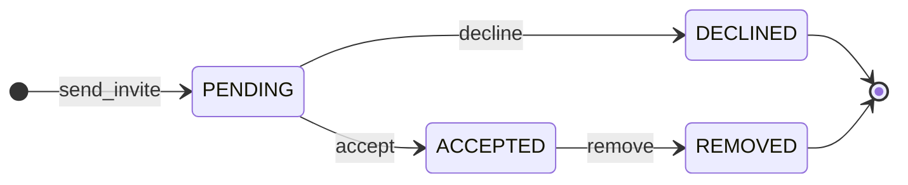
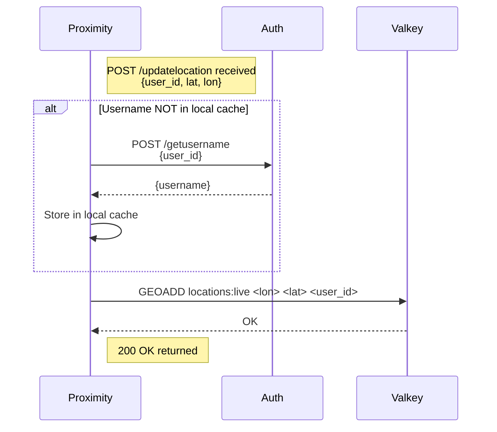
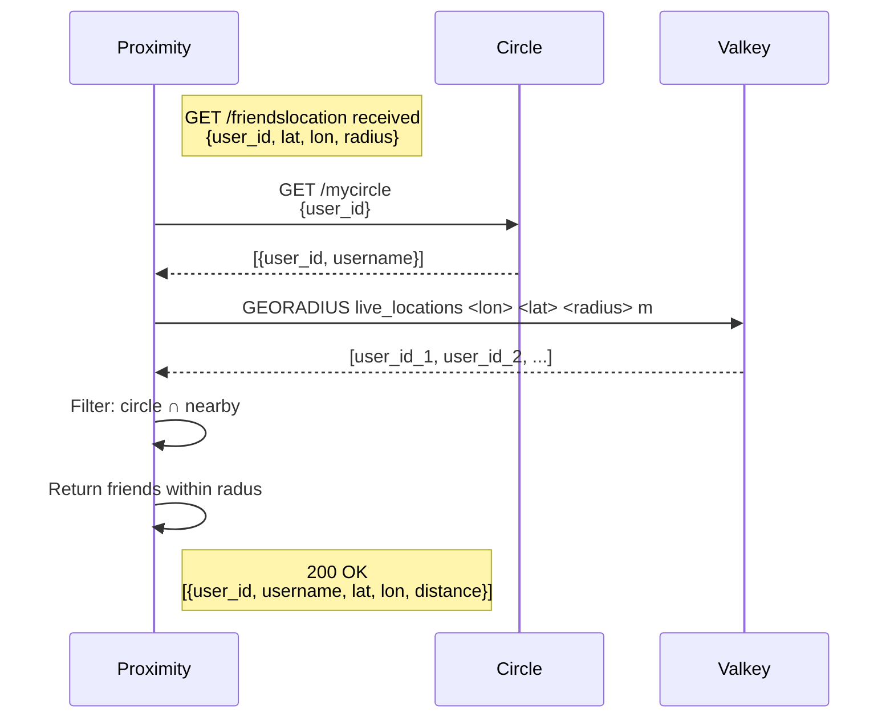

---

# Introduction

Most student software projects, at their core, end up being a single service sitting on top of a database.
GoClub is not that.

It is a location-aware social platform that depends on real-time data from active users, an event system with flexible visibility controls, a friend-circle model built around invitation state, and a wider community layer for broader group membership. All of these pieces need to work together, built by a team of four students under academic time pressure, across development environments that ranged from one laptop to another.

At the centre of the application is the idea of the **inner circle**: a small group of close contacts who share live location, making it possible to answer a simple spontaneous question — who is nearby right now, and do they want to meet?
Layered on top of this are Groups (communities based on shared interests) and Events (structured gatherings with RSVP and configurable visibility, similar in concept to Eventbrite but aimed at a university setting).

However, the most interesting part of this project is not the feature set.
It is the engineering decisions the team was pushed into making by three problems that turned out to be far more difficult than expected:

- coordinating parallel development across multiple services

- achieving reproducible environments and deployments

- handling high-frequency, real-time GPS data that did not fit the assumptions of a traditional relational database

This report tells the story of those three problems, and how the architecture evolved in response to them.

# Requirements and Constraints

> **Intent:** High level description of requirements so reader can understand the archiecture that fell outa these.

## Functional Requirements

> **Intent:** A summary of our epics. what the system does.


## Non-Functional Constraints

> **Intent:** Cover team size, deployment environment, privacy/security, and scope — this could dovetail with the git
> process, what we got to and didnt, and how our dev env looked like.


# System Overview

GoClub is composed of five backend microservices, an API gateway, a shared common library, a Valkey in-memory cache, and a Jinja-templated frontend. All components are orchestrated by Docker Compose into a single deployable stack. The service decomposition maps directly to the six functional domains: Frontend, Auth, Circles, Groups, Events and Proximity.

{ width=90% }

Each service is a self-contained Python FastAPI application packaged as a Docker container, communicating with the outside world exclusively through the NGINX gateway. The common library is not a service; it is a shared Python package mounted into each service container at runtime, providing database session management, SQLAlchemy base models, and JWT processing utilities.

The gateway routes requests by URL path prefix: any request to `/auth/*` is forwarded to the Auth service, `/circles/*` to the Circles service, and so on. This design means adding a new service requires one additional to the NGINX configuration block. 

Valkey sits alongside the relational database as a second data tier, serving exclusively the Proximity service. Its role and the reasoning behind its selection are the subject of Section XXX.

# Challenge One — Coordinating Parallel Development

The microservices decomposition was not chosen because it is architecturally fashionable. It was chosen because the team needed to build six microservices simultaneously without each developer's work becoming a bottleneck for everyone else. That goal is only achievable if the coordination problem is solved. A microservices architecture with poor coordination is worse than a monolith: all the integration headache, none of the parallel development.

The team's response was three-layered: Agile process to align work to service boundaries, Git discipline to protect integration points, and documentation as a contract that enabled work to proceed before all services existed.

## Agile Process and the Mapping of Stories to Services

The team used Google [Projects](https://github.com/orgs/The-Parliment/projects/3) to track work using epics and user stories. The team tried to make sure story boundaries matched service boundaries. An epic for "Proximity Feature" decomposed into stories that could each be owned by a single developer: the Valkey integration, the location update endpoint, the nearby-users query, and the frontend map component. These stories could be worked on in parallel because their integration points were agreed upfront as API contracts, not figured out the hard way when everything tried to merge at once. 



## Git Discipline and the Pull Request as Integration Gate

Each story lived on its own feature branch. Code only reached main through a pull request, which acted as the team's integration gate — the point where a change went from "works on my machine" to "works in the system." With 50+ tracked issues across the project, this wasn't optional. Branch names followed the story structure, so there was always a clear line from a tracked issue to the code that closed it. Keeping this up consistently across four people over 8 weeks, especially under deadline pressure, was harder than it sounds.

{ width=80% }

## MkDocs as a Development Contract

This is the most underappreciated decision in the project's process story. The team adopted MkDocs not as a documentation deliverable to be produced at the end, but as a coordination tool used during development. Each service owner documented their API design — endpoints, request schemas, response structures — before or alongside implementation.

As the team had already been documenting APIs and designs in a docs/ folder, adding a mkdocs.yaml took minutes — but the benefits far outweighed the effort.


The real power of MkDocs here was that it packaged everyone's APIs and designs into a single searchable site — one place to check rather than hunting through files or waiting on a teammate to reply.
The consequence was significant: a developer building the Events service could code against the Circles API without the Circles service being complete, because the contract was written down and easily searchable. The documentation site became a substitute for a developer being physically available to answer questions. In a team working across different schedules and locations, this is not a minor convenience — it is the difference between parallel work and sequential work.


> **Key insight:** Documentation written *during* development is a design
> tool. Documentation written *after* development is a historical record.
> Only the former enables parallel work.

# Challenge Two — Reproducible Deployment of a Multi-Service Stack

> **Intent:** Explain the deployment problem and the discipline behind the Docker Compose solution — not what Docker is, but why it mattered here.

## Container-Per-Service and the Isolation Benefit

> **Intent:** Explain what containerisation bought the team in terms of consistency, isolation, and conflict-free collaboration.


## NGINX as the Unifying Gateway

> **Intent:** Explain why a single gateway — single origin, extensible by addition — was the right choice.

```bash
server {
    listen 80;
    server_name _;

    # Auth service: /auth/* -> auth container, strip /auth prefix
    location /auth/ {
        rewrite ^/auth/(.*)$ /$1 break;
        proxy_pass http://auth:8000/;
        proxy_set_header Host $host;
        proxy_set_header X-Real-IP $remote_addr;
        proxy_set_header X-Forwarded-For $proxy_add_x_forwarded_for;
        proxy_set_header X-Forwarded-Proto $scheme;
    }
```

## The Two-Phase Development Loop

> **Intent:** Describe the local-dev/full-stack-dev split(aka uvicorn vs docker) and why keeping both modes viable avoided slow feedback loops.


## The Nuclear Option

> **Intent:** Frame the full state-reset command as a first-class operational tool, not an admission of failure.

```bash
docker compose down --volumes --remove-orphans
docker system prune -af
sudo rm common/app.db
```

# The Core Services

Four of the five services — Auth, Circles, Groups, and Events — share a common
character: they manage entities that change infrequently, have clear relational
structure, and benefit from transactional consistency. This section describes
each concisely, focusing on boundary decisions and architecturally notable
design choices. Full API references and data model details are available at the
MkDocs documentation site.

## Auth Service

The Auth service owns user identity: registration, login, and profile management. Its core architectural responsibility is JWT issuance. Token verification is local — each service validates the JWT signature using the shared secret from the common library, without a network call back to Auth on every request. This removes both a single point of failure and a latency cost that would otherwise appear on every authenticated API call across the system.

The scope boundary is deliberate: Auth answers "who are you?" It does not answer "what are you allowed to do here?" Keeping authorisation logic in the relevant domain service means Auth stays small and focused, and avoids becoming a bottleneck as the system grows.

## Circles Service

Circles are the social core of the application: small, invitation-based groups representing close friendships. The defining data model decision is the invitation state machine. A circle membership passes through explicit states — invited, accepted, declined, removed — and the service enforces valid transitions. This prevents a user from appearing in circle queries before their invitation is accepted.

The circle boundary is also the privacy boundary for location sharing. Onlyaccepted circle members can see each other's positions in the Proximity service. The Circles service is the authority on membership; the Proximity service delegates that question rather than reimplementing it.



## Groups Service

Groups serve a different social function from Circles. Where a Circle is intimate and invitation-only, a Group is a community of shared interest that can be public or private.
The distinction is set by the creator at the time of group creation. 

A public group is discoverable by any user via `/list` and open to join without any approval — any authenticated user can add themselves. 

A private group is invisible to non-members entirely; it does not appear in discovery at all. Rather than a request-and-approve flow, membership in a private group is entirely owner-controlled: only the creator can add users via `/join` on their behalf. This keeps the permission model simple — there is no pending state, no invite negotiation, the owner either adds someone or they are not in the group.

The same owner authority extends to removal. The `/removemember` endpoint is restricted to the group owner — members cannot remove each other, only the creator can manage the roster. This binary owner/member model is intentionally lightweight for the scope of the project; a production system might introduce moderator roles, but for GoClub the distinction was sufficient.

The public/private flag also propagates into the Events service: an event scoped to a group is only visible to its members, so the Events service must resolve group membership at query time. The Groups service remains the single source of truth for membership, and the Events service defers to it rather than duplicating that logic.

## Events Service

Roisin to add.......

## Frontend Service

Cillian to add - benefit of server side html rendering with jinja


---

# Challenge Three — When the Database Is the Wrong Tool

Every service in Section XXX fits comfortably into the same data model: SQLAlchemy-managed tables in SQLite, accessed through the common library. Users, circles, groups, events, memberships — these change infrequently, have stable relational structure, and benefit from ACID guarantees.

GPS coordinates do not fit this model. Understanding why, and finding a better tool for the problem, is what this section covers.

## The Problem with GPS Location in a Relational Database

Every active user sends a position update at high frequency — potentially every few seconds. In a realistic scenario with twenty concurrent active users, that is twenty writes per second.  SQLite uses file-level locking — only one write at a time. With twenty users pinging updates every few seconds, they'd be queuing behind each other, and that latency would be immediately visible.

The read side is equally problematic. A proximity query — "which of my circle members are within 500 metres?" — requires computing the spherical distance between the querying user's coordinates and every other active user's coordinates. This involves expensive mathematical operations across every row in the active-user set. Without a spatial index this becomes a full-table scan on every proximity request.

A further mismatch: location data has no meaningful durability requirement. If the application restarts, users send a fresh position within seconds of reconnecting. Forcing volatile state into durable storage solves a problem that does not need to be solved.

## The Research Process and the Discovery of Valkey

Rather than building a custom solution, the team stepped back and asked what the data actually needed — then searched for tools built for exactly that.

The tool needed to do four things: keep data in memory for speed, handle geospatial queries natively, expire stale positions automatically, and handle high write volume without locking.

Redis already had all of this built in through its geospatial command set. `GEOADD` stores a coordinate under a named key. `GEODIST` computes distance between two stored points, applying complex math formula internally. `GEOSEARCH` returns all stored points within a given radius. The spherical geometry that would have required significant custom implementation is a single
command.

We chose Valkey over Redis because it felt more in line with the spirit of the project. When Redis changed their license in 2024, the community forked it into Valkey to keep it truly open. Honestly, we picked it because it sounded cooler—a bit more anarchist, backed by the Linux Foundation, and a direct 'thumbing of the nose' at the rug-pull. Technically, it was a perfect drop-in; we got the native GEOADD and GEORADIUS commands we needed for high-frequency GPS data without changing a single line of the Redis Python client.

### Update Location


### Get Friends Inside Radius


## The Resulting Two-Tier Data Architecture

The Valkey integration pushed the project toward two separate data tiers.

**SQLite with SQLAlchemy**, managed through the common library, serves all durable, relational, slowly-changing data: user accounts, circle memberships, group memberships, events, RSVPs. This is the system of record.

**Valkey** serves short-lived, high-frequency, spatially-indexed data: the current position of active users. Data carries a TTL and expires automatically when a user goes offline. No explicit delete logic is required.

This is a multi-database architecture — different storage engines for data with genuinely different needs.

> **The transferable lesson:** Valuable engineering move in this
> project was the decision not to write code. Knowing that a problem 
> is already solved — and finding the tool that solves it — is a 
> more valuable skill than building something from scratch.

# Cross-Cutting Concerns

> **Intent:** Cover the two elements that span all services and explain the trade-offs of each choice. Perhaps we present the schema?

## The Common Library

> **Intent:** Justify centralised shared code as the right coupling decision at this scale, while honestly acknowledging the trade-off.


## JWT and Distributed Authentication

> **Intent:** Explain local token verification and the benefits as a shared library - aka the verify & decode commonality.


---

# Future Improvements

> **Intent:** Record chapter per future work — not as apologies.


## User Lifecycle Event Bus and DB per service

> **Intent:** Identify the user-deletion cleanup problem and describe an event bus as the correct solution using existing infrastructure.


## Priority Two API Completion

> **Intent:** Note that descoped work is documented and intentional, not a gap.


# Lessons Learned


## On Deployment: Make the Environment a First-Class Artefact

> **Intent:** Argue that containerising early and treating docker-compose.yml as canonical saved the team from an entire class of failures.

# Conclusion

> **Intent:** Close by arguing that the problems encountered — and the thinking required — are the same ones that appear at any scale.


- **GitHub:** <https://github.com/The-Parliment/cs3305_2026_team_8>
- **Documentation:** <https://the-parliment.github.io/cs3305_2026_team_8/>
